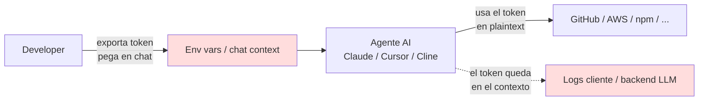
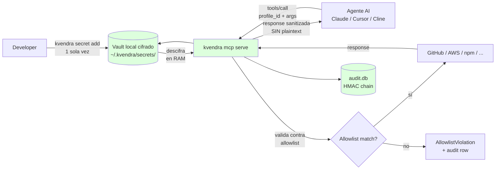

# 2. Mental model — capability-based security en tres minutos

## Descripción

La idea técnica de Kvendra CLI no es nueva: aplica al ecosistema de agentes de IA un patrón clásico que en sistemas operativos se llama **capability-based security**, y que en el cloud lleva años operando como AWS IAM Roles + STS, Sigstore Cosign, HashiCorp Vault dynamic secrets o Apple Keychain con biometría.

Lo nuevo es la aplicación a MCP, que es donde viven los asistentes de programación en 2026.

Este capítulo explica el modelo conceptual sin entrar en cripto ni protocolo. Si te quedas con una sola idea, que sea ésta: **no le des el token al agente; dale la capacidad de ejecutar operaciones concretas**.

## Cómo trabaja un agente sin Kvendra

Hoy, sin un broker, el flujo típico es:

El plaintext del token recorre puntos donde no debería estar nunca: el contexto de la conversación, los logs del cliente MCP, posiblemente el backend del modelo dependiendo del setup. Cada uno de esos puntos es una superficie de exfiltración.

## Cómo trabaja un agente con Kvendra

Con el binario `kvendra` actuando de broker, el flujo cambia:

Tres invariantes que el broker garantiza:

> **Invariante 1: el plaintext no cruza al agente.**
> El secret se descifra en memoria del proceso `kvendra mcp serve`, se usa para construir la request al servicio externo (típicamente como header `Authorization: Bearer <plaintext>`), y la response se pasa por `mcp::server::build_sanitized_payload` antes de devolverse al agente.
>
> **Invariante 2: lo que el agente puede hacer está acotado.**
> Cada profile tiene una *allowlist* declarativa YAML que enumera operaciones, repos, buckets, métodos HTTP, patterns de URL, binarios shell permitidos. Cualquier invocación fuera de scope produce `AllowlistViolation` antes de tocar al servicio externo.
>
> **Invariante 3: cada acción queda registrada.**
> Cada `tools/call` (con éxito o fallo) genera una row en `~/.kvendra/audit.db` *antes* de devolver respuesta. Las rows están encadenadas con HMAC; manipularlas rompe la chain y `kvendra audit --verify` lo detecta.

## Tres conceptos que vas a ver constantemente

Tres palabras del [glosario canónico](./README.md) merecen mención explícita ya:

- **profile** — identidad lógica que une `(secret cifrado, allowlist YAML)`. Un PAT de GitHub puede existir como `github.kvendraai.org-admin` (scope amplio) y como `github.kvendraai.read-only` (lectura), apuntando al mismo token físico pero con allowlists distintas. El `profile_id` sigue convención dot-namespace; lo eliges tú al crear el secret.
- **primitive** — capability MCP canónica del catálogo `kvendra.<servicio>.<acción>`. Las 7 canónicas + escape hatch están descritas en el [capítulo 14](./14-primitives.md).
- **allowlist** — DSL declarativo YAML por profile. Defaults restrictivos. Cubierta en el [capítulo 7](./07-allowlist-dsl.md) (uso) y [capítulo 15](./15-allowlist-enforcer.md) (interno).

## La parte honesta

Capability-based security no es magia. El modelo Kvendra explícita lo que protege y lo que no en el [threat model](./18-threat-model.md). En particular:

- Mientras la sesión está *unlocked*, la derived key vive en RAM. Un atacante con root + ptrace puede dumpearla. Esto es el **vector O1**, aceptado como trade-off de la categoría de producto. La mitigación post-MVP es hardware-backed wrapping (Secure Enclave / TPM / Yubikey).
- Si el agente usa el escape hatch `kvendra.unsafe.raw_token`, el plaintext **sí** llega al contexto del agente — por diseño, para casos edge no cubiertos. Cada uso queda audit-flagged.
- El detection layer flagea o bloquea tokens detectados en input/output, pero no es un sustituto del workflow correcto: si pegas un token nuevo en el chat, lo más sensato es importarlo (`kvendra secret import`) y rotar el original.

## Cómo encaja con la promesa de marca

Trust narrative formal:

> *Even with full access to your filesystem (excluding the running process memory while unlocked), the only thing visible is encrypted blobs that are mathematically useless without your master password.*

Esa frase es la **Promesa Nivel 2 zero-knowledge** (`ROAD-KVD-004`, formalizada en `ADR-KVD-010`). El resto del manual desarrolla cómo se cumple en código, qué garantías criptográficas la sostienen y qué vectores quedan explícitamente fuera de scope.

## Notas importantes

> **Nota:** Si vienes de HashiCorp Vault o de AWS Secrets Manager, reconocerás patterns familiares: descifrado server-side, scope binding, audit log. La diferencia es que Kvendra CLI ejecuta todo *local-first*, sin servicio remoto, con un solo binario y sin servidor que mantener. Los modos cloud existirán en `kvendra-platform` (AGPL-3.0) cuando llegue Pro/Team tier.

> **Advertencia:** El mental model de capability-based security exige una pequeña fricción adicional: tienes que *crear el profile* la primera vez (`kvendra secret add`) y *escribir su allowlist*. Esa fricción es deliberada — está donde estaría el riesgo si dejases al agente operar libre con el token. Si te sientes tentado a usar `kvendra.unsafe.raw_token` "para ir más rápido", pregúntate antes si no estás justamente reintroduciendo la opción A del [capítulo 1](./01-introduccion.md).
