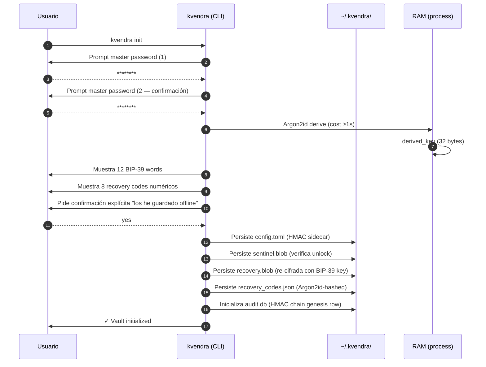

# 4. Bootstrap del vault — `kvendra init`

## Descripción

`kvendra init` crea la estructura `~/.kvendra/` en tu home, deriva la *encryption key* desde un master password que tú eliges, genera una **recovery phrase BIP-39 de 12 palabras** y un set de **8 recovery codes** numéricos one-time. Es el primer comando que ejecutas tras instalar y solo se ejecuta una vez por máquina.

Este capítulo describe el flujo paso a paso, qué se persiste, qué tienes que guardar offline y cómo abortar limpiamente si algo va mal antes del commit final.

## Prerrequisitos

- Binario `kvendra` instalado y verificable con `kvendra --version` ([capítulo 3](./03-instalacion.md)).
- Carpeta `~/.kvendra/` no existe (o está vacía y dispuesto a sobrescribirla con confirmación).
- Lugar offline donde anotar la recovery phrase y los recovery codes (libreta, gestor de contraseñas physical, caja fuerte). Esto **no** es opcional.

## Flujo end-to-end



Hasta el paso 9 nada toca disco. Si abortas con Ctrl+C antes, no hay residuos.

## Pasos detallados

### Paso 1 — Lance el comando

```bash
kvendra init
```

No acepta argumentos posicionales. Banderas relevantes:

> **`--force`** — borra `~/.kvendra/` existente sin pedir confirmación adicional. **Operación destructiva.** Solo úselo si está re-inicializando desde cero un vault que no necesita.
>
> **`--non-interactive`** — falla si el TTY no está disponible. Útil para CI / scripts que pretenden detectar configuración faltante en lugar de bloquearse en un prompt.

### Paso 2 — Introduzca el master password

El binario pide la password dos veces (sin echo):

```
Master password:
Confirm master password:
```

Reglas:

- Mínimo 12 caracteres. No hay máximo.
- Validación: las dos entradas deben coincidir byte a byte.
- Cualquier diferencia aborta sin escribir nada a disco.

> **Advertencia:** Esta es la **única** password que tienes que recordar. No se persiste, no se sincroniza, no se recupera por email. Si la olvidas, necesitarás la recovery phrase BIP-39 (paso 4) o los recovery codes (paso 5) para volver a entrar al vault.

### Paso 3 — Espere la derivación Argon2id

Tras la confirmación, el binario ejecuta Argon2id con cost params calibrados a aproximadamente 1 segundo en hardware moderno. Verá un breve "computing..." y la prompt se libera cuando la derived key está en RAM.

La cost params están en `config.toml` y son fijas para `0.1.0`:

> **Argon2id parameters:**
> - `m_cost`: 65536 KiB (64 MiB)
> - `t_cost`: 3 iterations
> - `p_cost`: 4 lanes
> - Output: 32 bytes (clave AES-256-GCM)

Esto se cubre en detalle en el [capítulo 12](./12-vault-criptografia.md).

### Paso 4 — Anote la recovery phrase BIP-39

El binario imprime 12 palabras del wordlist BIP-39 estándar:

```
Your recovery phrase (12 words):

  1. abandon    2. ability    3. able       4. about
  5. above      6. absent     7. absorb     8. abstract
  9. absurd    10. abuse     11. access    12. accident

These words let you reset the master password if you forget it.
Write them down OFFLINE. They will not be shown again.
```

> **Advertencia:** Si en este momento haces screenshot, copias al clipboard, escribes en un fichero, o las dejas en el scrollback de tu terminal, **el dump de pantalla acaba siendo equivalente al token raíz del vault**. La recomendación canónica es escribirlas a mano en una libreta física o introducirlas en un gestor de contraseñas offline.

### Paso 5 — Anote los 8 recovery codes

A continuación se muestran 8 códigos numéricos:

```
Your recovery codes (8 single-use):

  1. 4827-1539-0026   2. 9180-2647-3315
  3. 5023-8194-6770   4. 1738-4205-9412
  5. 6914-3082-5867   6. 2456-7019-8133
  7. 8203-1654-9028   8. 3079-5482-1166

Each code can be used ONCE for critical actions (revoke, force-rotate, ...).
Save them with your recovery phrase.
```

Diferencias con la recovery phrase:

| | Recovery phrase | Recovery codes |
|---|---|---|
| Cantidad | 12 BIP-39 words | 8 numeric codes |
| Storage | Solo offline (tú) | `~/.kvendra/recovery_codes.json` (Argon2id-hashed) |
| Uso | Reset del master password | Confirmar acciones críticas |
| Reutilizables | Sí, hasta nuevo `init` | No, single-use |
| Regenerables | Solo con re-init | Sí: `kvendra config recovery-codes regenerate` (post `0.1.0`) |

Ver detalle de uso en el [capítulo 10](./10-recuperacion.md).

### Paso 6 — Confirme explícitamente que los ha guardado

El binario pide:

```
Type "yes" to confirm you have saved both the recovery phrase
AND the recovery codes offline:
```

Cualquier cosa distinta de `yes` aborta el init sin escribir nada a disco. Las palabras y códigos generados se zeroizan en RAM y se descartan. Tendrás que ejecutar `kvendra init` otra vez.

### Paso 7 — Verifique la estructura creada

Tras el confirm, el binario imprime:

```
✓ Vault initialized at /Users/<you>/.kvendra/
  - config.toml (HMAC-signed)
  - sentinel.blob
  - recovery.blob
  - recovery_codes.json (mode 0600)
  - audit.db (HMAC chain initialized)
```

Listado real:

```bash
ls -la ~/.kvendra/
```

Esperado:

```
config.toml          0600   # flags configurables, HMAC en config.toml.hmac
config.toml.hmac     0600   # firma sub-key kvendra/config-hmac/v1
sentinel.blob        0600   # used to verify unlock attempts
recovery.blob        0600   # KDF-mnemonic-derived ciphertext
recovery_codes.json  0600   # 8 Argon2id-hashed codes
audit.db             0600   # SQLite WAL, chain genesis row
secrets/             0700   # vacía (no profiles aún)
allowlists/          0700   # vacía (no allowlists aún)
```

Permisos `0600` en ficheros y `0700` en directorios. Si `umask` de tu shell es laxo, el binario igual fuerza estos modes — es defensa en profundidad.

## Aborto seguro

Hasta el paso 6 (confirm), todos los artefactos viven en RAM. Ctrl+C aborta limpiamente: no quedan ficheros parciales, la derived key se zeroiza, las recovery seeds se descartan.

A partir del paso 7, los ficheros existen. Si quiere descartarlos:

```bash
rm -rf ~/.kvendra/
```

> **Advertencia:** `rm -rf ~/.kvendra/` es destructivo. Si ya tenías profiles guardados, los pierdes irrecoverable salvo backup propio. En el bootstrap inicial es seguro porque aún no hay nada que perder.

## Validación post-init

Confirme que el unlock funciona antes de cerrar la sesión:

```bash
kvendra unlock
```

Introduzca el master password. Salida esperada:

```
✓ Vault unlocked. Session active until idle timeout (default 30 min).
```

Lock manual:

```bash
kvendra lock
```

Esto zeroiza la derived key en RAM y deja el vault locked. El siguiente `unlock` pedirá la password otra vez.

## Notas importantes

> **Nota:** El default de `idle_timeout_minutes` en `config.toml` es 30. Puede cambiarlo con `kvendra config set idle_timeout_minutes <N>`. Ver decisión en `ADR-KVD-012` y patrón conocido sobre el restart de Claude Code en `PAT-KVD-009` (también recogido en el [capítulo 22](./22-faq-troubleshooting.md)).

> **Advertencia:** No edite manualmente `config.toml` ni `recovery_codes.json`. Ambos están firmados con HMAC sidecar (`config.toml.hmac`) o hasheados (`recovery_codes.json` no editable trivialmente). Cualquier mismatch detectado al startup hace que el binario rechace la sesión con error explícito (vector L1 GAP_5/GAP_7 cerrados, ver [capítulo 18](./18-threat-model.md)).
