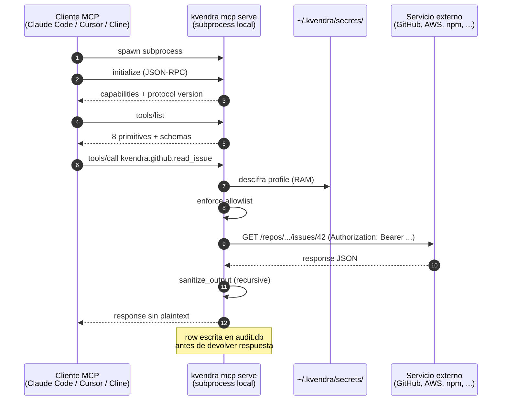

# 6. Uso vía MCP con agentes

## Descripción

Una vez tienes profiles cargados, conectar Kvendra a tu agente de IA es cuestión de añadir una entrada al fichero de configuración MCP del cliente. Kvendra arranca como **MCP server stdio**: el cliente lanza el subprocess `kvendra mcp serve` y se comunican vía JSON-RPC 2.0 sobre stdin/stdout.

Este capítulo cubre la integración con los tres clientes MCP probados en `AC-MCP-4`: **Claude Code** (canónico), **Cursor** y **Cline**. La integración con **Continue** es equivalente — siga las instrucciones de Cursor con cambios mínimos en path del fichero de configuración.

## Prerrequisitos

- Vault inicializado y unlocked ([capítulo 4](./04-bootstrap-vault.md)).
- Al menos un profile creado ([capítulo 5](./05-gestion-secretos.md)).
- Cliente MCP instalado (Claude Code, Cursor, Cline, Continue).
- Master password disponible para la sesión MCP (ver decisión en [capítulo 12](./12-vault-criptografia.md) sobre `mcp serve --use-keychain`).

## Diagrama del flujo



## Configuración por cliente

### Claude Code (canónico)

Edita `~/.claude.json` (o el fichero equivalente de tu instalación):

```json
{
  "mcpServers": {
    "kvendra": {
      "command": "kvendra",
      "args": ["mcp", "serve", "--use-keychain"]
    }
  }
}
```

> **`--use-keychain`** (macOS, 0.6.4) — opt-in al modo OS keychain ACL (ver [capítulo 12](./12-vault-criptografia.md)). El cliente MCP no da TTY al subprocess, así que sin una sesión previa el server no podría pedir la master password. Con keychain, el unlock se delega a Touch ID y es transparente para el cliente. **Es macOS-only en esta release** (REQ-KVD-005 / PAT-KVD-007). En Linux/Windows el patrón portable es **desbloquear en tu propio terminal** (`kvendra unlock`, ver más abajo) y arrancar el server con `args: ["mcp", "serve"]` (sin `--use-keychain`): el subprocess lee la sesión de `~/.kvendra/sessions/active.blob`. Alternativa no-interactiva: `--password-env` con `KVENDRA_MCP_PASSWORD`.

Tras editar el fichero, reinicia Claude Code para que recargue. Verifica:

- Comando `/mcp` lista `kvendra` como connected.
- Las 8 tools (`kvendra.git`, `kvendra.github`, `kvendra.npm`, `kvendra.pypi`, `kvendra.aws`, `kvendra.http`, `kvendra.shell`, `kvendra.unsafe.raw_token`) están enabled.

### Cursor

Edita `~/.cursor/mcp.json`:

```json
{
  "mcpServers": {
    "kvendra": {
      "command": "kvendra",
      "args": ["mcp", "serve", "--use-keychain"]
    }
  }
}
```

Reinicia Cursor. En *Settings → Tools / MCP* debe aparecer `kvendra` como connected.

### Cline

Edita el fichero de configuración MCP que Cline use en tu plataforma. La sintaxis es la misma: `command: kvendra`, `args: ["mcp", "serve", "--use-keychain"]`.

### Continue

`config.json` de Continue acepta el mismo shape `mcpServers`. Tras añadir la entrada, reinicia el extension.

## Modelo de sesión: `unlock` en tu terminal (cross-platform)

El `unlock` **siempre corre en TU terminal, nunca dentro del cliente MCP** — el cliente no le da un TTY al subprocess. `kvendra unlock` escribe `~/.kvendra/sessions/active.blob` (+ HMAC sidecar), **machine-bound** (hostname + uid + ruta), con un TTL. Cada `kvendra mcp serve` que arranca el cliente **lee ese blob** para obtener la clave de sesión; ningún `mcp serve` desbloquea el vault por su cuenta.

```bash
# En un terminal interactivo tuyo:
kvendra unlock                 # TTL default 4h
kvendra unlock --ttl 8h        # TTL a medida (sujeto a session.max_ttl)
kvendra session info           # modo (local/workspace) + TTL restante + workspace
kvendra unlock --extend        # refresca el TTL RE-AUTENTICANDO (master password, v0.6.4, finding A1)
```

Si el TTL expira, el siguiente `tools/call` falla con `VaultLocked` hasta que vuelvas a `kvendra unlock`. Un segundo temporizador, `idle_timeout_minutes` (`config.toml`, default 30), controla por separado la caché en RAM de la clave derivada.

> **Nota:** con Claude Code, tras un periodo largo de inactividad aparece el patrón `PAT-KVD-009`: los `tools/call` fallan hasta que el cliente reinicie su conexión MCP. La fix usual es **reiniciar Claude Code** (no solo re-`unlock`ar) — el cliente cachea handshakes que pueden quedar desincronizados. Para saber si el problema es la sesión o el cliente, mira primero `kvendra session info`. Detalles en el [capítulo 22](./22-faq-troubleshooting.md).

## Llamadas MCP típicas (visto desde el agente)

Lo que el agente envía y recibe es JSON-RPC. Ejemplos:

### `tools/list` — descubrimiento

Request:

```json
{ "jsonrpc": "2.0", "id": 1, "method": "tools/list" }
```

Response (extracto):

```json
{
  "jsonrpc": "2.0",
  "id": 1,
  "result": {
    "tools": [
      { "name": "kvendra.git", "description": "Run git operations against allowed repos using a stored credential profile. Token plaintext never returned to caller.", "inputSchema": { ... } },
      { "name": "kvendra.github", "description": "GitHub REST/GraphQL operations using a stored PAT profile. Token plaintext never returned.", "inputSchema": { ... } },
      ...
      { "name": "kvendra.unsafe.raw_token", "description": "[UNSAFE] Returns the plaintext credential. Use only when no canonical primitive covers your case. Each invocation is audit-flagged unsafe.", "inputSchema": { ... } }
    ]
  }
}
```

El cliente MCP puede usar esta lista para presentar las primitives en su UI, marcar la `unsafe` como peligrosa y construir formularios para `tools/call`.

### `tools/call` — invocación real

Request (ejemplo `kvendra.github.read_issue`):

```json
{
  "jsonrpc": "2.0", "id": 2, "method": "tools/call",
  "params": {
    "name": "kvendra.github",
    "arguments": {
      "profile_id": "github.kvendraai.read-only",
      "operation": "read_issue",
      "args": { "repo": "KvendraAI/kvendra-cli", "number": 42 }
    }
  }
}
```

Response:

```json
{
  "jsonrpc": "2.0", "id": 2,
  "result": {
    "content": [{ "type": "text", "text": "Issue #42: ..." }],
    "isError": false,
    "structuredContent": {
      "html_url": "https://github.com/KvendraAI/kvendra-cli/issues/42",
      "audit_event_id": 1234
    }
  }
}
```

El plaintext del PAT no aparece en ningún campo (invariante `AC-MCP-3` validado por test E2E).

## Detalle del subcomando `kvendra mcp serve`

Para depuración manual:

```bash
kvendra mcp serve [--use-keychain] [--password-env <VAR>] [--no-unlock]
```

Banderas reales en 0.6.4 (`kvendra mcp serve --help`):

> **`--use-keychain`** — lee la master password del OS keychain con ACL de presencia/biometría (**macOS-only en esta release** — REQ-KVD-005 / PAT-KVD-007).
>
> **`--password-env <VAR>`** — lee la master password de una env var (CI / no-interactivo, camino legacy). Var por defecto: `KVENDRA_MCP_PASSWORD`.
>
> **`--no-unlock`** — arranca sin paso de unlock. **El audit log queda deshabilitado** (relajación V4); úsalo solo para inspección sin credenciales.

> **Nota:** las operaciones destructivas **no** se habilitan con un flag de `mcp serve`. Se marcan por operación en el allowlist con `accept_destructive: true` (validado al `secret set-allowlist`); ver [capítulo 7](./07-allowlist-dsl.md) y [capítulo 15](./15-allowlist-enforcer.md).

## Verificación end-to-end

Tras configurar el cliente, una smoke check rápida desde el chat del agente:

> "Lista las tools de kvendra disponibles."

El agente debe enumerar las 8 primitives. Si falla, revisa:

- `kvendra mcp serve` no arranca: verifica que `kvendra` está en el `PATH` del proceso del cliente MCP. Algunos clientes lanzan el subprocess con un `PATH` reducido — usa la ruta absoluta en `command`.
- "VaultLocked": ejecuta `kvendra unlock` (modo TTY) o reconfigura `--use-keychain`.
- "ProfileNotFound": el agente está pidiendo `profile_id` que no creaste. Lista con `kvendra secret list`.

## Manifest de capabilities y break-glass

Para inspeccionar qué expone el broker sin abrir una sesión MCP, `kvendra capabilities` emite el **manifest canónico** del broker en JSON (read-only, auth-less; añadido en **0.5.0**, consumido por kvendra-skills):

```bash
kvendra capabilities            # JSON compacto de una línea
kvendra capabilities --pretty   # JSON multi-línea indentado
```

Si necesitas **relajar temporalmente** el enforcement del hook `kvendra-skills` (break-glass: `bypass` / `protect` / `grant-pubkey` / `verify-grant`, añadidos en 0.6.0), **no** se hace desde aquí: está cubierto en el [capítulo 23](./23-break-glass.md). Ese mecanismo actúa una capa por encima del allowlist y nunca entrega al agente el plaintext de un secreto.

## Notas importantes

> **Nota:** El binario es deliberadamente single-binary. No hay daemon en background, ni servicio del sistema, ni LaunchAgent / systemd unit. Cada cliente MCP que se conecta arranca su propio subprocess — diseño consciente para minimizar superficie de ataque y simplificar el modelo mental.

> **Advertencia:** No uses `kvendra mcp serve` directamente en un terminal interactivo a menos que estés depurando — el binario espera input JSON-RPC en stdin. Si lo lanzas y empiezas a teclear, el comportamiento es el esperado (parser JSON-RPC fallando), pero no es la forma normal de uso.
