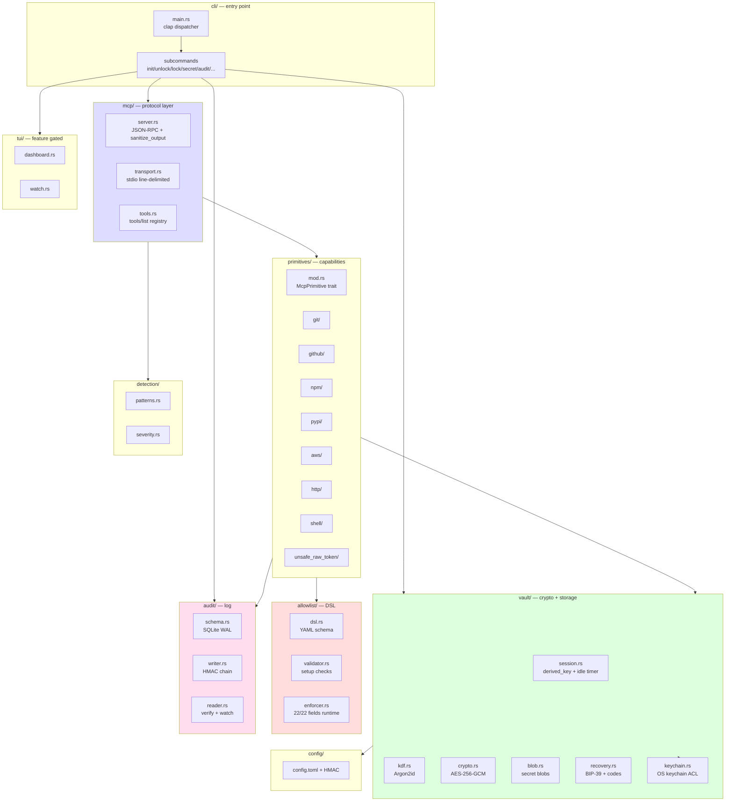
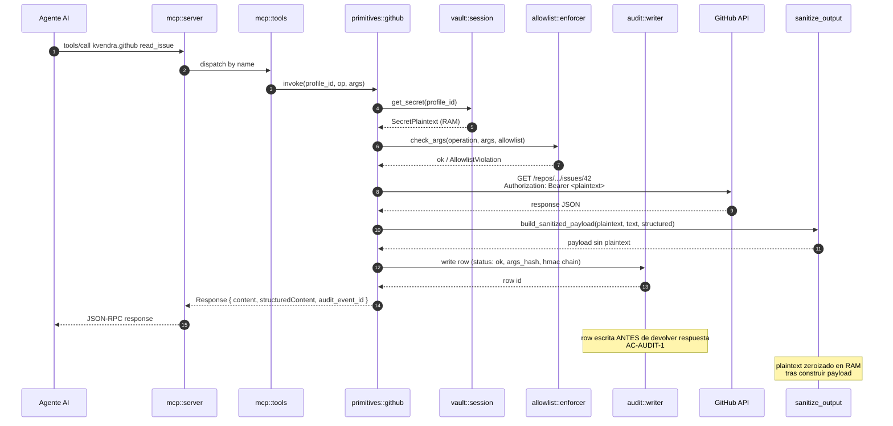

# 11. Arquitectura

## Descripción

El binario `kvendra` es una crate Rust única (edition 2024, MSRV 1.85) organizada en módulos canónicos por responsabilidad. No hay daemon, ni servicio del sistema, ni proceso background — cada cliente MCP que se conecta arranca su propio subprocess `kvendra mcp serve`.

Este capítulo describe los módulos, sus límites, cómo se conectan, y el flujo end-to-end de una invocación MCP. Los detalles internos de cada módulo crítico están en capítulos dedicados ([12](./12-vault-criptografia.md), [13](./13-mcp-server.md), [14](./14-primitives.md), [15](./15-allowlist-enforcer.md), [16](./16-detection-layer.md), [17](./17-audit-internals.md)).

## Vista de módulos

## Módulos

### `cli/` — punto de entrada

`main.rs` parsea argv con `clap` v4 (derive macros + env support) y despacha al subcomando correspondiente. Cada subcomando es un módulo separado bajo `cli/subcommands/`. La estructura es plana — sin frameworks de plugin, sin dynamic dispatch.

Subcomandos en `0.1.0`: `init`, `unlock`, `lock`, `secret`, `primitive`, `mcp`, `dashboard`, `audit`, `config`, `completion`.

### `vault/` — cripto y storage

Donde vive la disciplina zero-knowledge. Cubierto en detalle en el [capítulo 12](./12-vault-criptografia.md). Submódulos:

> **`vault::session`** — `Vault::unlock` / `Vault::lock`, derived_key en RAM, idle timer, constantes HKDF info (`kvendra/audit-hmac/v1`, `kvendra/allowlist-hmac/v1`, `kvendra/config-hmac/v1`).
>
> **`vault::kdf`** — Argon2id derive con cost params canónicos.
>
> **`vault::crypto`** — wrappers AES-256-GCM (`encrypt`, `decrypt`).
>
> **`vault::blob`** — formato de blob (header metadata + nonce + ciphertext + tag), serialización base64.
>
> **`vault::recovery`** — BIP-39 phrase generation y verification, recovery codes Argon2id-hashed.
>
> **`vault::keychain`** — OS keychain integration (Touch ID / Windows Hello / libsecret) con sentinel-presence flag (NO la derived key — `ADR-KVD-012`).

### `mcp/` — protocol layer

JSON-RPC 2.0 thin propio (decisión `ADR-KVD-006`, no `rmcp` SDK). Cubierto en el [capítulo 13](./13-mcp-server.md). Submódulos:

> **`mcp::server`** — loop principal, dispatch de `initialize`, `tools/list`, `tools/call`. Helper canónico **`mcp::server::build_sanitized_payload(plaintext, content_text, structured_content)`** que aplica `sanitize_output` recursivo a `text` + `structuredContent` antes de devolver respuesta al agente.
>
> **`mcp::transport`** — line-delimited JSON-RPC sobre stdin/stdout (`tokio::io::AsyncBufReadExt`).
>
> **`mcp::tools`** — registry de las 8 primitives canónicas; aporta el shape de `tools/list`.

### `primitives/` — capabilities canónicas

Ocho módulos, uno por primitive. Cada uno implementa el trait `McpPrimitive` con `fn invoke(profile, args) -> Response`. Cubiertos en el [capítulo 14](./14-primitives.md). Cada primitive resuelve credentials desde el vault, valida contra allowlist via `enforcer::check_args`, ejecuta (HTTP via `reqwest` o subprocess via `tokio::process::Command`) y devuelve la response sanitizada.

> **Excepción documentada del sanitization pattern:** `kvendra.unsafe.raw_token` omite explícitamente `build_sanitized_payload` (con comment justificando) — devuelve plaintext deliberadamente. Audit-flagged unsafe.

### `allowlist/` — DSL declarativo

Tres submódulos:

> **`allowlist::dsl`** — schema serde + parser YAML (`serde_yml`). Decisiones D1-D8 documentadas inline en doc-comments.
>
> **`allowlist::validator`** — checks setup-time. Los 3 fields meta (`accept_broad_scope`, `destructive`, `accept_destructive`) viven aquí, NO en enforcer (decisión D7).
>
> **`allowlist::enforcer`** — runtime check con 22/22 fields enforced (post alpha.10 fix `ISSUE-KVD-CLI-032`). TIER 0 helper `inner_args(envelope)` extrae `arguments.args` para todas las branches (corrige shape MCP envelope mismatch que era PAT-KVD-004 reapareciendo). TIER 1-4 con 19 branches usando helpers `regex_match`, `regex_full_match`, `extract_bucket_from_s3_uri`, `extract_owner_from_repo`, `argv_matches_template`. Cubierto en el [capítulo 15](./15-allowlist-enforcer.md).

### `audit/` — log con HMAC chain

> **`audit::schema`** — DDL de SQLite (`audit_events`, índices), WAL mode.
>
> **`audit::writer`** — escribe rows con HMAC chain antes de devolver respuesta MCP (AC-AUDIT-1).
>
> **`audit::reader`** — `--watch` (live tail), `--json` (export), `--verify` (re-deriva sub-key, valida chain).
>
> **`audit::hmac`** — HKDF-SHA256 sub-key, info `kvendra/audit-hmac/v1`.

Cubierto en el [capítulo 17](./17-audit-internals.md).

### `detection/` — regex + entropy

Cubierto en el [capítulo 16](./16-detection-layer.md). `patterns.rs` con set canónico (GitHub PAT classic, fine-grained, AWS Access Key, generic high-entropy, JWT). `severity.rs` con enum workspace (`warn | error | block`).

### `tui/` — gated por feature `tui`

Default-on. Submódulos `dashboard.rs` (vista global, AC-TUI-1) y `watch.rs` (live tail audit, AC-TUI-2). Stack `ratatui` 0.29 + `crossterm` 0.28.

### `config/` — configuración persistente

`~/.kvendra/config.toml` con flags configurables (`detection.severity`, `master-password.cache`, `idle_timeout_minutes`, `home_canonical`). HMAC sidecar `config.toml.hmac` con sub-key `kvendra/config-hmac/v1` cierra el vector L1 GAP_5/GAP_7 (ver [capítulo 18](./18-threat-model.md)).

## Flujo end-to-end de una invocación MCP

Puntos críticos del flujo:

> **Paso 5** — `Vault::get_secret` devuelve `Option<&SecretPlaintext>` con smart pointer que zeroiza en `Drop`. El plaintext nunca se copia.
>
> **Paso 7** — `enforcer::check_args` recibe el envelope MCP completo y usa el helper TIER 0 `inner_args(envelope)` para extraer `arguments.args`. Esto previene el PAT-KVD-004 shape mismatch.
>
> **Paso 9-10** — `sanitize_output` es **recursivo** sobre `text` + `structuredContent`. Aplica regex de detection patterns sobre cualquier string del payload; si encuentra match con el plaintext de la primitive, lo redacta a `[REDACTED]`. Helper canónico: `mcp::server::build_sanitized_payload`.
>
> **Paso 11** — La row de audit se escribe **antes** del return al agente (AC-AUDIT-1). Si el write fail, el call MCP falla con `AuditWriteFailed` — no hay degradación silenciosa del logging.

## Cargo features

| Feature | Default | Gates |
|---------|---------|-------|
| `tui` | **on** | `ratatui` + `crossterm` (TUI dashboard + audit watch). Disable para builds headless / minimal. |

Cargo features no exhaustivamente documentadas para `0.1.0`; `tui` es la única que el roadmap garantiza estable.

## Dependencias relacionales (KB v3)

- `part_of` → `PRJ-KVD`
- `fulfills` → `REQ-KVD-002`, `REQ-KVD-CLI-001..003`, `REQ-KVD-003..008`
- `affects` → `ROAD-KVD-005`
- `decided_by` → `ADR-KVD-004`, `ADR-KVD-005`, `ADR-KVD-006..012`, `ADR-KVD-022`

## Notas importantes

> **Nota:** El binario es deliberadamente **single-binary** y **single-process**. No hay daemon, no hay LaunchAgent / systemd unit, no hay proceso background. La razón: minimizar superficie de ataque, simplificar el modelo mental y mantener el invariante "el broker existe solo mientras el cliente MCP lo necesita".

> **Nota:** El árbol detallado de módulos Rust vive en el código fuente (`src/`) y en los doc-comments. Esta vista es conceptual — la fuente canónica para nombres exactos de tipos y funciones es `cargo doc --open`.
