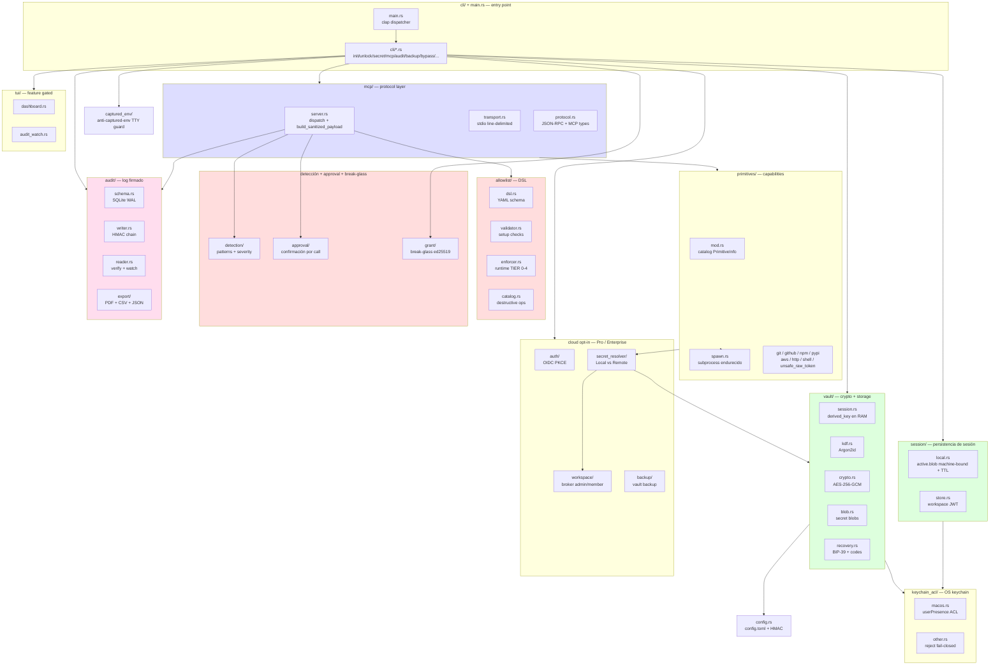
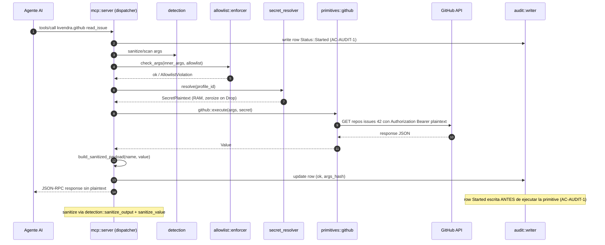

# 11. Arquitectura

## Descripción

El binario `kvendra` es una crate Rust única (edition 2024, MSRV 1.88) organizada en módulos canónicos por responsabilidad. No hay daemon, ni servicio del sistema, ni proceso background — cada cliente MCP que se conecta arranca su propio subprocess `kvendra mcp serve`.

Este capítulo describe los módulos, sus límites, cómo se conectan, y el flujo end-to-end de una invocación MCP. Los detalles internos de cada módulo crítico están en capítulos dedicados ([12](./12-vault-criptografia.md), [13](./13-mcp-server.md), [14](./14-primitives.md), [15](./15-allowlist-enforcer.md), [16](./16-detection-layer.md), [17](./17-audit-internals.md)).

## Vista de módulos

## Módulos

### `cli/` — punto de entrada

`main.rs` parsea argv con `clap` v4 (derive macros + env support) y despacha al subcomando correspondiente. Cada subcomando es un módulo separado bajo `cli/` (`cli/init.rs`, `cli/unlock.rs`, …), con el enum `Commands` en `cli/mod.rs`. La estructura es plana — sin frameworks de plugin, sin dynamic dispatch.

Subcomandos en `0.6.4`: `init`, `unlock`, `lock`, `login`, `logout`, `session` (`info`), `workspace`, `recover`, `secret`, `primitive`, `mcp`, `audit`, `dashboard`, `completion`, `config`, `backup`, `notifs`, `capabilities`, `bypass`, `protect`, `grant-pubkey`, `verify-grant`.

### `vault/` — cripto y storage

Donde vive la disciplina zero-knowledge. Cubierto en detalle en el [capítulo 12](./12-vault-criptografia.md). Submódulos:

> **`vault::session`** — `Vault::unlock` / `Vault::lock`, derived_key en RAM, idle timer, constantes HKDF info (`kvendra/audit-hmac/v1`, `kvendra/allowlist-hmac/v1`, `kvendra/config-hmac/v1`).
>
> **`vault::kdf`** — Argon2id derive con cost params canónicos.
>
> **`vault::crypto`** — wrappers AES-256-GCM (`encrypt`, `decrypt`).
>
> **`vault::blob`** — formato de blob (header metadata + nonce + ciphertext + tag), serialización base64.
>
> **`vault::recovery`** — BIP-39 phrase generation y verification, recovery codes Argon2id-hashed.

> **Nota:** en 0.6.4 la integración con el OS keychain vive en el módulo top-level **`keychain_acl/`** (`macos.rs` con `SecAccessControlCreateWithFlags(.userPresence)` — Touch ID o modal del OS; Windows/Linux rechazan fail-closed en esta release, `ADR-KVD-012` / `REQ-KVD-005`), no bajo `vault/`.

### `session/` — persistencia de sesión

`vault::session` mantiene la derived key **en RAM**; la **sesión en disco** vive aparte, en `session/`:

> **`session::local`** — `~/.kvendra/sessions/active.blob` machine-bound (hostname + uid + ruta), cifrado bajo la vault key, con TTL. Lo escribe `kvendra unlock` en tu terminal y lo lee cada `kvendra mcp serve` (`REQ-KVD-CLI-011` / `ADR-KVD-029`). `session::ttl` y `session::wrap_key` sostienen el TTL y el wrapping.
>
> **`session::store`** — token JWT de workspace (`<workspace>.token`, mode 0600) para el modo Pro/Enterprise (`ADR-KVD-ENTERPRISE-002`).

### `mcp/` — protocol layer

JSON-RPC 2.0 thin propio (decisión `ADR-KVD-006`, no `rmcp` SDK). Cubierto en el [capítulo 13](./13-mcp-server.md). Submódulos:

> **`mcp::server`** — el **dispatcher**: `initialize`, `tools/list`, `tools/call`. Antes de ejecutar una primitive resuelve el profile, corre detection sobre los args, valida el allowlist (`enforcer`), aplica el approval layer y sólo entonces despacha (`git::execute`, `github::execute`, …). Helper canónico **`mcp::server::build_sanitized_payload(name, value) -> (String, Value)`**, que devuelve `(text, structuredContent)` scrubbeados vía `detection::sanitize_output` + `detection::sanitize_value` — salvo la excepción documentada `kvendra.unsafe.raw_token`, tratada por nombre dentro de la propia función.
>
> **`mcp::transport`** — line-delimited JSON-RPC sobre stdin/stdout (`tokio::io::AsyncBufReadExt`).
>
> **`mcp::protocol`** — tipos wire JSON-RPC 2.0 + MCP (request/response/error, payload de `tools/list`). El **catálogo de las 8 primitives** no vive aquí sino en `primitives::catalog()` (`CATALOG: [PrimitiveInfo; 8]`), que `mcp::server` usa para construir `tools/list` y que también alimenta `kvendra primitive list`.

### `primitives/` — capabilities canónicas

Ocho módulos, uno por primitive (`git.rs`, `github.rs`, `npm.rs`, `pypi.rs`, `aws.rs`, `http.rs`, `shell.rs`, `unsafe_raw_token.rs`), más `mod.rs` (el catálogo `PrimitiveInfo`) y `spawn.rs`. **No hay trait dinámico**: cada módulo expone `pub async fn execute(args, secret) -> KvendraResult<Value>` y el dispatcher de `mcp::server` hace un `match` estático sobre el nombre de la capability. El secret se resuelve vía `secret_resolver` (local o broker remoto), el allowlist se valida en el dispatcher (`enforcer::check_args`) y la ejecución es HTTP (`reqwest`) o subprocess. Cubiertos en el [capítulo 14](./14-primitives.md).

> **`primitives::spawn`** — spawner de subprocess **endurecido**, compartido por las primitives que lanzan binarios (`git`, `npm`, `aws`, `shell`). Consolida el hardening del pentest adversarial 0.6.4 (`ISSUE-KVD-CLI-B78ED5`): scrub del entorno (retira `KVENDRA_*` del hijo — finding N1), `--ignore-scripts` en npm (N2), `--registry` pinneado (N6). Ver [capítulo 18](./18-threat-model.md).

> **Excepción documentada del sanitization pattern:** `kvendra.unsafe.raw_token` devuelve plaintext deliberadamente. La excepción está **dentro** de `build_sanitized_payload` (rama `name == "kvendra.unsafe.raw_token"`, con comment justificando), gated por el flag de profile `unsafe_raw_token_enabled` y una quota por sesión. Audit-flagged unsafe.

### `allowlist/` — DSL declarativo

Cuatro submódulos:

> **`allowlist::dsl`** — schema serde + parser YAML (`serde_yaml_ng`). Decisiones D1-D8 documentadas inline en doc-comments.
>
> **`allowlist::validator`** — checks setup-time. Los fields meta (`accept_broad_scope`, `destructive`, `accept_destructive`) viven aquí, NO en enforcer (decisión D7).
>
> **`allowlist::enforcer`** — runtime check por capas sobre las 22 fields del DSL. TIER 0 helper `inner_args(envelope)` extrae `arguments.args` en todas las branches (cierra el shape MCP envelope mismatch, `PAT-KVD-004`). TIER 1-4 con helpers `regex_match`, `extract_bucket_from_s3_uri`, `extract_owner_from_repo`, `argv_matches_template`, más denylists fail-closed (D4/D8). En 0.6.4 se cerró **fail-closed** la última familia de fields que aún quedaban no-op por un mismatch de nombre de campo. Cubierto en el [capítulo 15](./15-allowlist-enforcer.md).
>
> **`allowlist::catalog`** — catálogo de operaciones marcadas `destructive` que exigen opt-in (alimenta el approval layer y la validación de setup).

### `audit/` — log con HMAC chain

> **`audit::schema`** — DDL de SQLite (`audit_events`, índices), WAL mode; `audit::migrations` y `audit::bootstrap` gestionan versión de esquema e inicialización.
>
> **`audit::writer`** — escribe rows con HMAC chain antes de devolver respuesta MCP (AC-AUDIT-1). `audit::error_code` clasifica el diagnóstico en las columnas forenses.
>
> **`audit::reader`** — `--watch` (live tail), `--json` (export legacy), `--verify` (re-deriva sub-key, valida chain).
>
> **`audit::hmac`** — HKDF-SHA256 sub-key, info `kvendra/audit-hmac/v1`.
>
> **`audit::export`** — bundle firmado **PDF + CSV + JSON canónico** (`kvendra audit export`, `REQ-KVD-CLI-007`) con redaction; `kvendra audit verify-export` re-verifica el JSON canónico. Shipped en 0.6.2.

Cubierto en el [capítulo 17](./17-audit-internals.md).

### `detection/` — regex + entropy

Cubierto en el [capítulo 16](./16-detection-layer.md). `patterns.rs` con set canónico (GitHub PAT classic, fine-grained, AWS Access Key, generic high-entropy, JWT). El enum de severidad (`DetectionSeverity`: `Warn | Error | Block`) vive en `detection/mod.rs`; se configura desde el bloque `[detection]` de `config.toml` (no hay CLI para setearla en 0.6.4). `mod.rs` expone también `sanitize_output` / `sanitize_value`, el scrubbing recursivo que usa el broker.

### `tui/` — gated por feature `tui`

Default-on. Submódulos `dashboard.rs` (vista global, AC-TUI-1) y `audit_watch.rs` (live tail audit, AC-TUI-2). Stack `ratatui` 0.29 + `crossterm` 0.28.

### `config.rs` — configuración persistente

Un único módulo `config.rs` (ya no un directorio). `~/.kvendra/config.toml` con secciones `[vault]` (`master_password_cache` — default `ram-only`, `idle_timeout_minutes` — default 30, `home_canonical`), `[detection]` (`severity`), `[approval]` (`mode` — default `ask-destructive`, `timeout_seconds`, `cache_ttl_seconds`), `[telemetry]` y `[session]`. HMAC sidecar `config.toml.hmac` con sub-key `kvendra/config-hmac/v1` cierra el vector L1 GAP_5/GAP_7 (ver [capítulo 18](./18-threat-model.md)); `home_canonical` ancla la ruta del vault contra `home_redirect`.

### `approval/` — confirmación interactiva

Approval layer per `tools/call` (`REQ-KVD-003`). Tres modos (`ADR-KVD-013..016`): `silent` (default CI, sin TTY), `ask` (cada call) y `ask-destructive` (**default**: prompt sólo si la operación está marcada `destructive` en el allowlist). Submódulos `policy`, `tty`, `biometric`, `cache` (TTL configurable) y `transport`.

### `grant/` — break-glass

Módulo del break-glass (`kvendra bypass` / `protect` / `grant-pubkey` / `verify-grant`, `REQ-KVD-SKILLS-41032D`). Firma **asimétrica ed25519**: la clave privada se cifra bajo la vault key (AES-256-GCM, machine-bound); la pública se exporta sin unlock para que el hook de `kvendra-skills` verifique el grant **sin** vault desbloqueado (un HMAC simétrico no serviría: el verificador podría forjar grants). Submódulos `keypair`, `sign`, `verify`, `store`. Cubierto en el [capítulo 23](./23-break-glass.md).

### `captured_env/` — defensa anti-captured-env

Protege `kvendra unlock` de ejecutarse dentro de un cliente MCP (Bash tool de Claude Code, escape `!`, Cursor, Cline). Detecta el entorno capturado y rechaza determinísticamente para que la master password nunca aterrice en un transcript que el LLM pueda leer (`PAT-KVD-CLI-008`). Capas: `/dev/tty` (POSIX) / `IsTerminal` (Windows) + análisis de ancestry del proceso.

### Módulos cloud (opt-in) — `auth/`, `workspace/`, `secret_resolver/`, `backup/`, `protocol/`

Toda la superficie cloud es opt-in y **cloud-agnostic por construcción** (sin strings de proveedor):

> **`auth/`** — OIDC discovery + PKCE Authorization Code + refresh proactivo del JWT (`kvendra login --workspace`). IdP en `KVENDRA_AUTH_URL` (default `https://auth.kvendra.cloud`).
>
> **`workspace/`** — operaciones admin/member contra el broker (`kvendra workspace …`); base URL `KVENDRA_BROKER_URL` (default `https://api.kvendra.cloud`). Incluye `allowlist_sync` y `metadata_sync`.
>
> **`secret_resolver/`** — trait `SecretResolver` con dos impls: `LocalVaultResolver` (lee el blob local; steady state del tier standalone) y `RemoteBrokerResolver` (pide un token efímero al broker). Es el punto que decide de dónde sale el secret que consume cada primitive.
>
> **`backup/`** — backup cloud del vault (Pro tier, `REQ-KVD-CLI-005`): sub-key HKDF `kvendra/backup-cipher/v1`, AES-256-GCM, bundle = tar del vault cifrado, detección de conflicto por `parent_version_etag`.
>
> **`protocol/`** — tipos wire para hablar con el broker Enterprise (placeholder de scaffolding que se (re)generará desde el OpenAPI 3.1 cerrado).

## Flujo end-to-end de una invocación MCP

Puntos críticos del flujo:

> **Audit primero (AC-AUDIT-1).** La row `Status::Started` se escribe **antes** de ejecutar la primitive; el resultado actualiza esa row. Si el write de audit falla, el call MCP falla — no hay degradación silenciosa del logging.
>
> **El enforcement lo hace el dispatcher, no la primitive.** `enforcer::check_args` recibe el envelope MCP y usa `inner_args(envelope)` (TIER 0) para extraer `arguments.args`, evitando el shape mismatch `PAT-KVD-004`. La primitive sólo se ejecuta si el allowlist (y detection, y approval) dan luz verde.
>
> **El secret no se copia.** `secret_resolver` entrega un `SecretPlaintext` con smart pointer que zeroiza en `Drop`; se usa para construir la request al servicio externo y no cruza al agente.
>
> **Sanitización recursiva.** `build_sanitized_payload(name, value)` devuelve `(text, structuredContent)` scrubbeados vía `detection::sanitize_output` + `detection::sanitize_value`. Única excepción: `kvendra.unsafe.raw_token`, tratada por nombre dentro de la función.

## Cargo features

| Feature | Default | Gates |
|---------|---------|-------|
| `tui` | **on** | `ratatui` + `crossterm` (TUI dashboard + audit watch). Disable para builds headless / minimal. |

Cargo features no exhaustivamente documentadas para `0.6.4`; `tui` es la única que el roadmap garantiza estable.

## Dependencias relacionales (Kvendra KB)

- `part_of` → `PRJ-KVD`
- `fulfills` → `REQ-KVD-002`, `REQ-KVD-CLI-001..003`, `REQ-KVD-003..008`
- `affects` → `ROAD-KVD-005`
- `decided_by` → `ADR-KVD-004`, `ADR-KVD-005`, `ADR-KVD-006..012`, `ADR-KVD-022`

## Notas importantes

> **Nota:** El binario es deliberadamente **single-binary** y **single-process**. No hay daemon, no hay LaunchAgent / systemd unit, no hay proceso background. La razón: minimizar superficie de ataque, simplificar el modelo mental y mantener el invariante "el broker existe solo mientras el cliente MCP lo necesita".

> **Nota:** El árbol detallado de módulos Rust vive en el código fuente (`src/`) y en los doc-comments. Esta vista es conceptual — la fuente canónica para nombres exactos de tipos y funciones es `cargo doc --open`.
