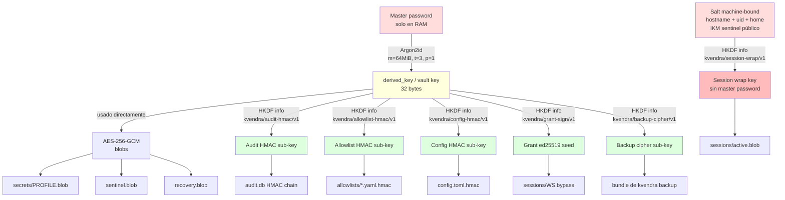

# 12. Vault y criptografía

## Descripción

El **vault** es la pieza fundacional del threat model Nivel 2 zero-knowledge. Vive enteramente en la máquina del usuario. Almacena blobs cifrados con AES-256-GCM con clave derivada del master password vía Argon2id. La derived key vive solo en RAM mientras el vault está unlocked y se zeroiza determinísticamente al lock o al timeout. En Pro tier existe `kvendra backup` (bundle cifrado client-side antes de subir), pero el plaintext y la derived key jamás cruzan la red.

Este capítulo describe los primitives criptográficos, el layout en disco, el dominio de keys (HKDF para las 6 sub-keys vivas en `0.6.4`) y las garantías de manejo de memoria. Las decisiones de diseño detrás están en `ADR-KVD-005` (crypto stack), `ADR-KVD-010` (threat model), `ADR-KVD-012` (storage de master password), `ADR-KVD-022` (naming de sub-keys HKDF) y `ADR-KVD-029` (wrap key machine-bound del blob de sesión).

## Layout en disco

```
~/.kvendra/                      mode 0700
├── config.toml                  mode 0600  flags configurables
├── config.toml.hmac             mode 0600  sub-key kvendra/config-hmac/v1
├── sentinel.blob                mode 0600  AES-GCM blob de prueba (verifica unlock)
├── recovery.blob                mode 0600  KDF-mnemonic-derived ciphertext
├── recovery_codes.json          mode 0600  8 codes Argon2id-hashed
├── secrets/                     mode 0700
│   └── <profile_id>.blob        mode 0600  uno por secret
├── allowlists/                  mode 0700
│   ├── <profile_id>.yaml        mode 0600
│   └── <profile_id>.yaml.hmac   mode 0600  sub-key kvendra/allowlist-hmac/v1
├── sessions/                    mode 0700
│   ├── active.blob              mode 0600  blob de sesión machine-bound (wrap key kvendra/session-wrap/v1)
│   ├── active.blob.hmac         mode 0600  sidecar HMAC del blob de sesión
│   ├── pro.token                mode 0600  bearer JWT Pro tier (kvendra login --pro)
│   ├── <workspace_id>.token     mode 0600  sesión OIDC de workspace
│   └── <workspace>.bypass       mode 0600  grant break-glass firmado ed25519 (cap. 23)
└── audit.db                     mode 0600  SQLite WAL, HMAC chain
```

Permisos forzados por el binario al arranque, independientemente del `umask` del shell.

## Primitives criptográficos

| Primitive | Crate | Versión | Uso |
|-----------|-------|---------|-----|
| KDF | `argon2` | 0.5 | Master password → derived key |
| AEAD | `aes-gcm` | 0.10 | Cifrado de blobs |
| HKDF | `hkdf` 0.12 (sobre `sha2` 0.10) | — | Domain separation para sub-keys |
| HMAC | `hmac` | 0.12 | Audit chain, allowlist sidecar, config sidecar, sidecar del blob de sesión |
| Firma asimétrica | `ed25519-dalek` | 2 | Grants break-glass ([cap. 23](./23-break-glass.md)) |
| Memory clearing | `zeroize` | 1 | `Drop` impls que sobrescriben buffers |
| Constant-time | `subtle` | 2 | Comparaciones de hashes y MACs |
| Mnemonic | `bip39` | 2 | Recovery phrase 12 words |

## Argon2id parameters

Cost params canónicos de producción (`KdfParams::high_cost`, calibrados a ≥1 segundo en hardware moderno — `REQ-KVD-002` AC-VAULT-4):

> **`m_cost` = 65536 KiB (64 MiB)**
>
> **`t_cost` = 3 iterations**
>
> **`p_cost` = 1 lane**
>
> **Output length = 32 bytes** (clave AES-256-GCM)
>
> **Algoritmo:** Argon2id, version `0x13` (v1.3)

Salt: **random 16 bytes por blob**, generado al crear cada blob y almacenado en el header del propio blob (`kdf.salt`), no en `config.toml`. La salt no es secret — viaja en claro dentro del blob — pero es única por blob, suficiente para defender contra rainbow tables.

> **Nota:** los tests usan params reducidos (`m_cost` 19 456 KiB, `t_cost` 2, `p_cost` 1) para no penalizar la suite; siguen siendo Argon2id real. La recuperación por mnemónica también deriva con params reducidos por su naturaleza single-use.

Verificación AC-VAULT-4: master password incorrecto produce error de descifrado en <2 s. La cost de Argon2id por intento (~1 s) garantiza resistencia a bruteforce remoto del blob exfiltrado (V8 del threat model).

## Derivación de keys



### Domain separation con HKDF

Las constantes canónicas viven junto a su consumidor (todas son byte-strings, no `&str`):

```rust
// src/vault/session.rs
pub const HKDF_INFO_AUDIT_HMAC: &[u8]     = b"kvendra/audit-hmac/v1";
pub const HKDF_INFO_ALLOWLIST_HMAC: &[u8] = b"kvendra/allowlist-hmac/v1";
pub const HKDF_INFO_CONFIG_HMAC: &[u8]    = b"kvendra/config-hmac/v1";
// src/grant/mod.rs
pub const HKDF_INFO_GRANT_SIGN: &[u8]     = b"kvendra/grant-sign/v1";
// src/session/wrap_key.rs
pub const HKDF_INFO_SESSION_WRAP: &[u8]   = b"kvendra/session-wrap/v1";
// src/backup/mod.rs
pub const BACKUP_HKDF_INFO: &[u8]         = b"kvendra/backup-cipher/v1";
```

Cada sub-key se deriva con HKDF-SHA256 con un `info` distinto. **Razón**: separar dominios criptográficos. El sufijo `/v1` permite rotación sin breaking change. Patrón formalizado en `ADR-KVD-022`.

En `0.6.4` hay **6 sub-keys vivas**. Cinco (`audit-hmac`, `allowlist-hmac`, `config-hmac`, `grant-sign`, `backup-cipher`) se derivan de la clave del vault, protegida por la master password. La sexta, **`session-wrap`, es la excepción**: se deriva de un salt machine-bound (`hostname` + `uid` + home canónico) y un IKM sentinela **público** (`kvendra-session-wrap-sentinel-v1`), **sin** la master password. Ese diseño (`ADR-KVD-029`) es lo que permite que `mcp serve` reabra la sesión sin re-pedir contraseña — y es exactamente el residual **C3** del [capítulo 18](./18-threat-model.md): un proceso mismo-uid, con el vault desbloqueado, puede reconstruir esa wrap key con solo datos públicos. **No lo confundas** con el seed del grant (`grant-sign`), que sí está sellado bajo la clave maestra y por eso el agente no puede forjar grants.

## Sentinel blob — verificación de unlock

`sentinel.blob` es un AES-GCM ciphertext de un magic-string conocido cifrado con la `derived_key`. Sirve para verificar que el master password introducido es correcto **sin necesidad de descifrar un secret real**.

Flujo de unlock:

1. Usuario introduce master password.
2. Argon2id derive con la salt de `config.toml`.
3. Intenta descifrar `sentinel.blob` con la derived key.
4. AES-GCM tag mismatch → password incorrecto, error genérico, retry.
5. Match → derived key cargada en RAM, sesión activa.

## Blobs de secret — formato

Cada `~/.kvendra/secrets/<profile_id>.blob` es un objeto **JSON** (`src/vault/blob.rs`) con los campos binarios en base64:

```json
{
  "version": 1,
  "kdf": { "m_cost_kib": 65536, "t_cost": 3, "p_cost": 1, "salt": "<b64>" },
  "nonce": "<b64>",
  "ciphertext": "<b64>"
}
```

- `version` — versión de formato del blob (`Blob::VERSION = 1`).
- `kdf` — los `KdfParams` con los que se derivó la clave de **este** blob (incluida su salt de 16 bytes). Autocontenido: no depende de `config.toml`.
- `nonce` — nonce de 12 bytes de AES-256-GCM.
- `ciphertext` — el ciphertext AES-GCM (el tag de autenticación de 16 bytes va anexado por `aes-gcm`, no como campo aparte).

Los metadatos no secretos del perfil (`secret_type`, `expiration`, flag `unsafe_raw_token_allowed`, timestamps) se guardan aparte y se consultan con `kvendra secret get-meta` sin descifrar el plaintext.

Inspeccionado fuera de la sesión, un blob es opaco — no hay plaintext detectable (AC-VAULT-2).

## Manejo de memoria — `zeroize`

Tipos canónicos del módulo `vault`:

```rust
#[derive(ZeroizeOnDrop)]
pub struct MasterPassword(SecretBytes);

#[derive(ZeroizeOnDrop)]
pub struct DerivedKey([u8; 32]);

#[derive(ZeroizeOnDrop)]
pub struct SecretPlaintext(Vec<u8>);
```

Reglas estrictas:

> **Nunca** persistido a disco salvo el blob cifrado.
>
> **Nunca** logueado.
>
> **Nunca** en variable de entorno persistida (la one-shot `KVENDRA_PASSWORD` para `audit --verify` es vector O1.env-var explícito y se `unsetenv()` tras lectura).
>
> `zeroize` en cada buffer temporal (impls `ZeroizeOnDrop`).
>
> `subtle::ConstantTimeEq` en comparaciones de hashes/MACs.

## Storage de la derived key (post-unlock)

Modos posibles, decisión `ADR-KVD-012`:

| Modo | Storage | Activación |
|------|---------|-----------|
| **Default (RAM-only)** | RAM del proceso `kvendra mcp serve` durante la sesión, zeroizada en lock o idle timeout (default 30 min) | Sin flags |
| **OS keychain ACL** | El keychain almacena un **sentinel-presence flag** (NO la derived key); el password sigue siendo requerido en cada unlock pero protegido por biometric ACL `userPresence` (macOS en esta release) | `--use-keychain` en `mcp serve` |
| **Blob de sesión machine-bound** | `~/.kvendra/sessions/active.blob`: la derived key va cifrada con la **session wrap key** (`kvendra/session-wrap/v1`, machine-bound, sin master password) + sidecar HMAC + TTL. Permite que cada `mcp serve` reabra la sesión sin re-teclear la contraseña | Escrito por `kvendra unlock` |

> **Decisión clave**: el modo `--use-keychain` **NO almacena la derived key** en el keychain. Almacena un sentinel cifrado con una key protegida por biometría; el unlock real sigue requiriendo el master password textual o re-derivar tras `userPresence` confirmation. Esta sutileza cierra el vector L1 GAP_1 + GAP_2.

> **Advertencia (C3):** el blob de sesión `active.blob` **sí** guarda la derived key como payload, cifrada con una wrap key derivada de inputs **públicos** (machine-bound, sin la master password). Es un trade-off consciente (`ADR-KVD-029`) para no re-pedir la contraseña en cada invocación: un proceso mismo-uid con el vault desbloqueado puede recuperar la clave. Es el residual **C3** del [capítulo 18](./18-threat-model.md); el fix real es el hardware-backed wrapping del roadmap (opt-in).

## Idle timeout

`config.toml`:

```toml
[session]
idle_timeout_minutes = 30
```

Comportamiento:

- Cada `tools/call` o cualquier subcomando `kvendra <cmd>` resetea el timer (sliding window, estilo `sudo`).
- Pasados N minutos sin actividad, la `SessionKey` en RAM se zeroiza automáticamente.
- El siguiente call falla con `VaultLocked` — salvo que el blob de sesión `active.blob` siga vigente por su TTL (default 4h, `session.default_ttl_seconds`), en cuyo caso `mcp serve` hace **self-heal**: re-inyecta la derived key desde el blob sin reiniciar el cliente.
- En modo `--use-keychain`, el re-unlock dispara el biometric prompt; en modo TTY, hay que ejecutar `kvendra unlock` manual.

`idle_timeout_minutes` (default 30) se lee del bloque `[session]` de `config.toml`; el TTL del blob de sesión se fija con `kvendra unlock --ttl` (default `4h`). En `0.6.4` **no hay** un `kvendra config set` para estos valores (ver [cap. 15](./15-allowlist-enforcer.md) sobre la firma del `config.toml`): `config` gestiona `keychain`, `approval`, `mcp-password`, `rebind-home`, `recovery-codes` y `telemetry`.

## Sentinel-presence flag (keychain)

Cuando `--use-keychain` está activo, el keychain guarda:

```
service: kvendra
account: vault-sentinel
data:    AES-GCM(sentinel_string, key=biometric-protected)
ACL:     userPresence (Touch ID / Windows Hello / libsecret prompt)
```

El flag NO contiene la derived key. Su presencia, descifrable solo con biometric confirmation, autoriza al broker a pedir el master password real para derivar la key. Es una capa de "intent confirmation" sin pasar la key por el keychain.

## Recovery — BIP-39 phrase y codes

> **Advertencia (0.6.4):** el **reset de master password por mnemónica** (`kvendra recover`) está **temporalmente deshabilitado / fail-closed** mientras se construye una implementación segura mnemonic-bound. El comando existe pero rechaza. El camino de recuperación recomendado hoy es un **`kvendra backup`** cifrado. Guarda igualmente la mnemónica escrita para cuando la recuperación vuelva. Ver `../security/protection-levels.md` y el [capítulo 10](./10-recuperacion.md). Lo que sigue describe el material criptográfico que se genera y persiste.

Generación en `kvendra init` ([capítulo 4](./04-bootstrap-vault.md)):

- **BIP-39 phrase (12 words)**: `bip39::Mnemonic::generate(12)` con `rand` 0.8.x. Wordlist estándar.
- **Recovery phrase → key alternativa**: `Mnemonic::to_seed(passphrase=empty)` → BIP32-style derive (si lo necesitas en el código actual, comprobar `vault::recovery::generate_phrase` y la función de derive).
- **Recovery.blob**: AES-GCM ciphertext de una copia de la `derived_key` real, cifrada con la BIP-39 key. Permite reset del master password sin perder los blobs de secrets.
- **Recovery codes (8 numeric)**: cada uno con su propio salt random, hash Argon2id (cost reducido vs master password — los codes son single-use).

Detalle de uso en el [capítulo 10](./10-recuperacion.md).

## Vectores criptográficos cubiertos

Resumen mapping a `ADR-KVD-010`:

| Vector | Mitigación criptográfica |
|--------|--------------------------|
| V2 (read access a `~/.kvendra/`) | Argon2id high-cost + AES-256-GCM client-side |
| V3 (Kvendra-team malicious) | La derived key nunca cruza red; `kvendra backup` sube el bundle ya cifrado client-side |
| V4 (AWS breach) | Cifrado client-side antes de upload; el KMS de infra no toca los secretos del usuario |
| V8 (remote bruteforce) | Argon2id m=64MiB cost ~1s/intento |

Vectores **aceptados** explícitamente (out of crypto scope):

> O1 (RAM dump unlocked) — derived key vive en RAM. Mitigación post-MVP: hardware-backed wrapping.
>
> O1.env-var (process listing visibility) — `KVENDRA_PASSWORD` env var trade-off para CI. Mitigación: preferir `--password-stdin`.
>
> O3 (side-channel timing) — `subtle::ConstantTimeEq` ayuda pero no es perfecta.

Detalle completo en el [capítulo 18](./18-threat-model.md).

## Notas importantes

> **Nota:** El crate `time` está fijado a `0.3.47` específicamente, post-fix de `RUSTSEC-2026-0009`. No descender de versión accidentalmente. La pinning está en `Cargo.toml` y verificada en CI.

> **Advertencia:** Cualquier modificación al stack criptográfico (cambio de KDF params, cambio de AEAD, cambio de info HKDF) **debe** ir acompañada de:
>
> 1. ADR nuevo en el Kvendra KB documentando la transición.
> 2. Migration path para vaults existentes.
> 3. Bump de la versión de formato en el header de los blobs.
> 4. Test que verifica que un blob v1 sigue siendo descifrable tras la migración.
>
> Romper esto deja a usuarios sin acceso a sus secretos. La política es estricta.
