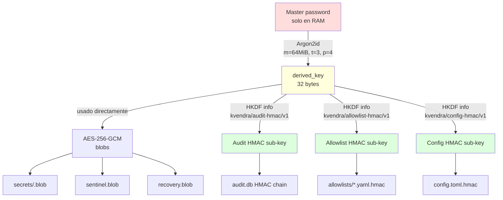

# 12. Vault y criptografía

## Descripción

El **vault** es la pieza fundacional del threat model Nivel 2 zero-knowledge. Vive enteramente en la máquina del usuario, sin sync server-side en `0.1.0`. Almacena blobs cifrados con AES-256-GCM con clave derivada del master password vía Argon2id. La derived key vive solo en RAM mientras el vault está unlocked y se zeroiza determinísticamente al lock o al timeout.

Este capítulo describe los primitives criptográficos, el layout en disco, el dominio de keys (HKDF para sub-keys de audit, allowlist y config) y las garantías de manejo de memoria. Las decisiones de diseño detrás están en `ADR-KVD-005` (crypto stack), `ADR-KVD-010` (threat model) y `ADR-KVD-012` (storage de master password).

## Layout en disco

```
~/.kvendra/                      mode 0700
├── config.toml                  mode 0600  flags configurables
├── config.toml.hmac             mode 0600  sub-key kvendra/config-hmac/v1
├── sentinel.blob                mode 0600  AES-GCM blob de prueba (verifica unlock)
├── recovery.blob                mode 0600  KDF-mnemonic-derived ciphertext
├── recovery_codes.json          mode 0600  8 codes Argon2id-hashed
├── secrets/                     mode 0700
│   └── <profile_id>.blob        mode 0600  uno por secret
├── allowlists/                  mode 0700
│   ├── <profile_id>.yaml        mode 0600
│   └── <profile_id>.yaml.hmac   mode 0600  sub-key kvendra/allowlist-hmac/v1
└── audit.db                     mode 0600  SQLite WAL, HMAC chain
```

Permisos forzados por el binario al arranque, independientemente del `umask` del shell.

## Primitives criptográficos

| Primitive | Crate | Versión | Uso |
|-----------|-------|---------|-----|
| KDF | `argon2` | 0.5.x | Master password → derived key |
| AEAD | `aes-gcm` | 0.10.x | Cifrado de blobs |
| HKDF | `hkdf` (vía `hmac` 0.12.x + `sha2` 0.10.x) | — | Domain separation para sub-keys |
| HMAC | `hmac` | 0.12.x | Audit chain, allowlist sidecar, config sidecar |
| Memory clearing | `zeroize` | 1.x | `Drop` impls que sobrescriben buffers |
| Constant-time | `subtle` | 2.x | Comparaciones de hashes y MACs |
| Mnemonic | `bip39` | 2.x | Recovery phrase 12 words |

## Argon2id parameters

Cost params canónicos para `0.1.0` (calibrados a ~1 segundo en hardware moderno):

> **`m_cost` = 65536 KiB (64 MiB)**
>
> **`t_cost` = 3 iterations**
>
> **`p_cost` = 4 lanes**
>
> **Output length = 32 bytes** (clave AES-256-GCM)

Salt: per-vault, 16 bytes random generados en `kvendra init`, persistidos en `config.toml`. La salt no es secret — está visible en el TOML — pero es única por vault, suficiente para defender contra rainbow tables.

Verificación AC-VAULT-4: master password incorrecto produce error de descifrado en <2 s. La cost de Argon2id por intento (~1 s) garantiza resistencia a bruteforce remoto del blob exfiltrated (V8 del threat model).

## Derivación de keys



### Domain separation con HKDF

`vault::session` define las constantes canónicas:

```rust
pub const HKDF_INFO_AUDIT_HMAC: &str     = "kvendra/audit-hmac/v1";
pub const HKDF_INFO_ALLOWLIST_HMAC: &str = "kvendra/allowlist-hmac/v1";
pub const HKDF_INFO_CONFIG_HMAC: &str    = "kvendra/config-hmac/v1";
```

Cada sub-key se deriva con HKDF-SHA256 desde la `derived_key` con info distinto. **Razón**: separar dominios criptográficos. Si se añade otra sub-key (ej. backup encryption), tendrá info `kvendra/backup-key/v1`. El sufijo `/v1` permite rotación sin breaking change.

Patrón formalizado en `ADR-KVD-022`. En alpha.7 hay 3 sub-keys vivas.

## Sentinel blob — verificación de unlock

`sentinel.blob` es un AES-GCM ciphertext de un magic-string conocido cifrado con la `derived_key`. Sirve para verificar que el master password introducido es correcto **sin necesidad de descifrar un secret real**.

Flujo de unlock:

1. Usuario introduce master password.
2. Argon2id derive con la salt de `config.toml`.
3. Intenta descifrar `sentinel.blob` con la derived key.
4. AES-GCM tag mismatch → password incorrecto, error genérico, retry.
5. Match → derived key cargada en RAM, sesión activa.

## Blobs de secret — formato

Cada `~/.kvendra/secrets/<profile_id>.blob` es base64 de:

```
[ header_metadata | nonce_12B | ciphertext | gcm_tag_16B ]
```

`header_metadata` incluye:

- Versión de formato (`u8`).
- Timestamp de creación (`u64` millis).
- `secret_type` (`String`, ej. `github_pat`, `aws_credentials`).
- Padding opcional para resistir size-based fingerprinting (post-MVP).

Inspeccionado fuera de la sesión, un blob es bytes opacos — no plaintext detectable (AC-VAULT-2).

## Manejo de memoria — `zeroize`

Tipos canónicos del módulo `vault`:

```rust
#[derive(ZeroizeOnDrop)]
pub struct MasterPassword(SecretBytes);

#[derive(ZeroizeOnDrop)]
pub struct DerivedKey([u8; 32]);

#[derive(ZeroizeOnDrop)]
pub struct SecretPlaintext(Vec<u8>);
```

Reglas estrictas:

> **Nunca** persistido a disco salvo el blob cifrado.
>
> **Nunca** logueado.
>
> **Nunca** en variable de entorno persistida (la one-shot `KVENDRA_PASSWORD` para `audit verify` es vector O1.env-var explícito y se `unsetenv()` tras lectura).
>
> `zeroize` en cada buffer temporal (impls `ZeroizeOnDrop`).
>
> `subtle::ConstantTimeEq` en comparaciones de hashes/MACs.

## Storage de la derived key (post-unlock)

Tres modos posibles, decisión `ADR-KVD-012`:

| Modo | Storage | Activación |
|------|---------|-----------|
| **Default (RAM-only)** | RAM del proceso `kvendra mcp serve` durante la sesión, zeroizada en lock o idle timeout (default 30 min) | Sin flags |
| **OS keychain ACL (Pase B)** | El keychain almacena un **sentinel-presence flag** (NO la derived key); el password sigue siendo requerido en cada unlock pero protegido por biometric ACL `userPresence` | `--use-keychain` en `mcp serve` |
| **OS keychain biometric cache (Beta+)** | Future: derived key cacheada en keychain biometric-protected | post-`0.1.0` |

> **Decisión clave**: el modo `--use-keychain` **NO almacena la derived key** en el keychain. Almacena un sentinel cifrado con una key protegida por biometría; el unlock real sigue requiriendo el master password textual o re-derivar tras `userPresence` confirmation. Esta sutileza cierra el vector L1 GAP_1 + GAP_2 enumerados en threat modeling Sesión 3.

## Idle timeout

`config.toml`:

```toml
[session]
idle_timeout_minutes = 30
```

Comportamiento:

- Cada `tools/call` o cualquier subcomando `kvendra <cmd>` resetea el timer.
- Pasados N minutos sin actividad, el broker zeroiza la derived key automáticamente.
- El siguiente call falla con `VaultLocked`.
- En modo `--use-keychain`, el re-unlock dispara el biometric prompt automáticamente; en modo TTY, hay que ejecutar `kvendra unlock` manual.

Cambiable con `kvendra config set idle_timeout_minutes <N>` (post-validación del HMAC sidecar de config).

## Sentinel-presence flag (keychain)

Cuando `--use-keychain` está activo, el keychain guarda:

```
service: kvendra
account: vault-sentinel
data:    AES-GCM(sentinel_string, key=biometric-protected)
ACL:     userPresence (Touch ID / Windows Hello / libsecret prompt)
```

El flag NO contiene la derived key. Su presencia, descifrable solo con biometric confirmation, autoriza al broker a pedir el master password real para derivar la key. Es una capa de "intent confirmation" sin pasar la key por el keychain.

## Recovery — BIP-39 phrase y codes

Generación en `kvendra init` ([capítulo 4](./04-bootstrap-vault.md)):

- **BIP-39 phrase (12 words)**: `bip39::Mnemonic::generate(12)` con `rand` 0.8.x. Wordlist estándar.
- **Recovery phrase → key alternativa**: `Mnemonic::to_seed(passphrase=empty)` → BIP32-style derive (si lo necesitas en el código actual, comprobar `vault::recovery::generate_phrase` y la función de derive).
- **Recovery.blob**: AES-GCM ciphertext de una copia de la `derived_key` real, cifrada con la BIP-39 key. Permite reset del master password sin perder los blobs de secrets.
- **Recovery codes (8 numeric)**: cada uno con su propio salt random, hash Argon2id (cost reducido vs master password — los codes son single-use).

Detalle de uso en el [capítulo 10](./10-recuperacion.md).

## Vectores criptográficos cubiertos

Resumen mapping a `ADR-KVD-010`:

| Vector | Mitigación criptográfica |
|--------|--------------------------|
| V2 (read access a `~/.kvendra/`) | Argon2id high-cost + AES-256-GCM client-side |
| V3 (Kvendra-team malicious) | La derived key nunca cruza red en `0.1.0` (no hay sync) |
| V4 (AWS breach post-MVP) | Cifrado client-side antes de upload (cuando exista cloud sync) |
| V8 (remote bruteforce) | Argon2id m=64MiB cost ~1s/intento |

Vectores **aceptados** explícitamente (out of crypto scope `0.1.0`):

> O1 (RAM dump unlocked) — derived key vive en RAM. Mitigación post-MVP: hardware-backed wrapping.
>
> O1.env-var (process listing visibility) — `KVENDRA_PASSWORD` env var trade-off para CI. Mitigación: preferir `--password-stdin`.
>
> O3 (side-channel timing) — `subtle::ConstantTimeEq` ayuda pero no es perfecta.

Detalle completo en el [capítulo 18](./18-threat-model.md).

## Notas importantes

> **Nota:** El crate `time` está fijado a `0.3.47` específicamente, post-fix de `RUSTSEC-2026-0009`. No descender de versión accidentalmente. La pinning está en `Cargo.toml` y verificada en CI.

> **Advertencia:** Cualquier modificación al stack criptográfico (cambio de KDF params, cambio de AEAD, cambio de info HKDF) **debe** ir acompañada de:
>
> 1. ADR nuevo en KB v3 documentando la transición.
> 2. Migration path para vaults existentes.
> 3. Bump de la versión de formato en el header de los blobs.
> 4. Test que verifica que un blob v1 sigue siendo descifrable tras la migración.
>
> Romper esto deja a usuarios sin acceso a sus secretos. La política es estricta.
