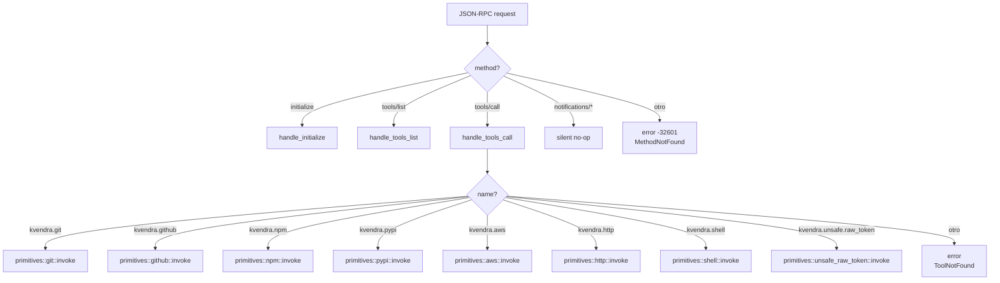
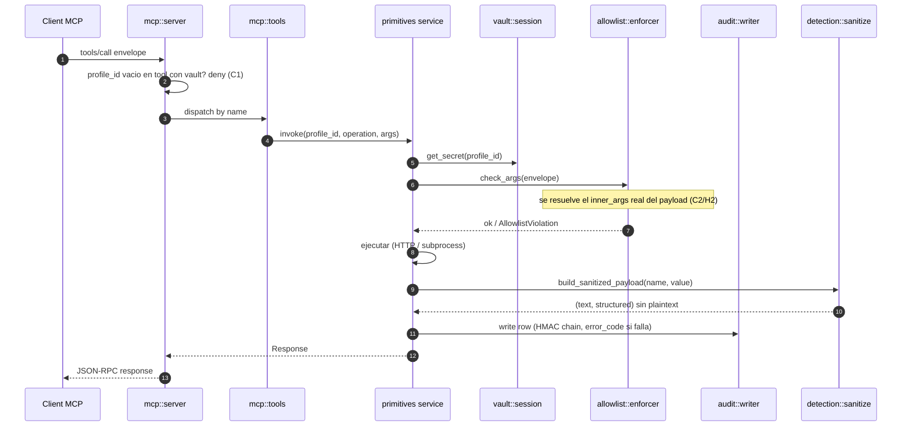

# 13. Servidor MCP

## Descripción

`kvendra mcp serve` arranca un proceso JSON-RPC 2.0 sobre stdio que implementa el subset del protocolo **MCP (Model Context Protocol)** necesario para que un cliente como Claude Code, Cursor, Cline o Continue invoque las primitives canónicas. El subprocess vive solo mientras el cliente lo necesita; cuando el cliente cierra stdin, el broker termina limpiamente.

Este capítulo cubre la implementación interna: protocolo, transport, dispatch de métodos, sanitización del payload y manejo de errores. La integración desde el lado del cliente está en el [capítulo 6](./06-uso-mcp-con-agentes.md).

## Decisión: thin JSON-RPC propio (no `rmcp`)

`ADR-KVD-006` formaliza la elección: implementación thin propia en lugar de adoptar el SDK comunitario `rmcp`. Razones:

> **Bajo coste eng** (~2-3 días para los métodos que necesitamos: `initialize`, `tools/list`, `tools/call`).
>
> **Sin dependencia de SDK joven** que aún tiene churn de API significativo.
>
> **Control total** sobre la sanitization del payload — `build_sanitized_payload` es nuestro y crítico.
>
> **Migración futura abierta**: si `rmcp` madura, la migración es local al módulo `mcp/` sin tocar primitives.

## Protocolo soportado

El broker anuncia `protocolVersion` = `"2025-03-26"` (constante `PROTOCOL_VERSION` en `mcp::server`). `0.6.4` implementa el subset mínimo:

| Method | Direction | Status |
|--------|-----------|--------|
| `initialize` | client → server | implementado |
| `notifications/initialized` | client → server (notif) | aceptado, no-op server-side |
| `tools/list` | client → server | implementado |
| `tools/call` | client → server | implementado |
| Cualquier otro (`resources/*`, `prompts/*`, otras `notifications/*`) | — | error `-32601` (`method not implemented`) |

El cliente solo necesita estos para el uso canónico: descubrir las primitives (`tools/list`) y ejecutarlas (`tools/call`). Un frame con `jsonrpc` distinto de `"2.0"` se rechaza con `-32600` (`InvalidRequest`).

## Transport — line-delimited JSON-RPC sobre stdio

`mcp::transport` es una capa fina sobre `tokio::io::AsyncBufReadExt`:

- Cada mensaje JSON-RPC es **una línea** de stdin/stdout (`mcp::transport::StdioTransport`).
- Encoding UTF-8. Cada response se escribe con `\n` final y `flush`.
- `Content-Length` headers (forma alternativa de framing MCP) **no** se soportan — todos los clientes probados (Claude Code, Cursor, Cline) usan line-delimited.
- Una línea **en blanco / whitespace** se salta (no es EOF): evita que un hijo que tocó el pipe heredado mate el loop (`ISSUE-KVD-CLI-330251`). Solo `read_line` devolviendo `n == 0` (pipe cerrado) es un EOF real.

Pseudocódigo del loop principal (`mcp::server`):

```rust
loop {
    match transport.read().await {
        Ok(Some(req)) => {
            let resp = dispatch(req, ctx.clone()).await;
            transport.write(&resp).await?;   // error de I/O real → fin del loop
        }
        Ok(None) => break,                    // EOF limpio: el cliente cerró stdin
        Err(McpProtocol(_)) => {
            // Finding S4c: una línea JSON-RPC MALFORMADA es recuperable, no fatal.
            // Respondemos parse error (-32700) y SEGUIMOS SIRVIENDO.
            transport.write(&parse_error()).await?;
            continue;
        }
        Err(e) => break,                      // solo un error de transporte real corta
    }
}
```

> **Nota (S4c, 0.6.4):** antes de `0.6.4` cualquier línea no parseable terminaba el serve loop — una sola línea hostil (o un write espurio de un subproceso) mataba la sesión del broker = DoS. Ahora se responde `-32700` y el loop continúa; solo un error de I/O de transporte lo corta.

Logs van a **stderr** — el cliente solo lee stdout, así que stderr es seguro para `tracing::info!` sin contaminar el protocolo.

## Dispatch

`mcp::server::dispatch` decide qué hacer según `request.method`:



## `initialize` — handshake

Request canónico:

```json
{
  "jsonrpc": "2.0", "id": 1, "method": "initialize",
  "params": {
    "protocolVersion": "2025-03-26",
    "clientInfo": { "name": "claude-code", "version": "1.x" },
    "capabilities": {}
  }
}
```

Response:

```json
{
  "jsonrpc": "2.0", "id": 1,
  "result": {
    "protocolVersion": "2025-03-26",
    "serverInfo": { "name": "kvendra", "version": "0.6.4" },
    "capabilities": { "tools": {} }
  }
}
```

`serverInfo.version` es la versión del crate (`env!("CARGO_PKG_VERSION")`), no un string fijo. El broker no anuncia capabilities `resources` ni `prompts` porque no las soporta. El cliente respeta el shape mínimo y no las pide.

## `tools/list` — catálogo

`tools_list` recorre el `catalog()` de primitives y devuelve, por cada una, un `ToolDescriptor { name, description, inputSchema }` (`p.tools_list_description()` + `p.input_schema()`). Son las **7 primitives canónicas + el escape hatch** (8 entradas).

Cada entry tiene shape:

```json
{
  "name": "kvendra.<service>",
  "description": "...",
  "inputSchema": {
    "type": "object",
    "properties": {
      "profile_id": { "type": "string", ... },
      "operation": { "type": "string", "enum": [...] },
      "args": { "type": "object", ... }
    },
    "required": ["profile_id", "operation", "args"]
  }
}
```

La excepción `kvendra.unsafe.raw_token` lleva `description` con prefix `[UNSAFE]` (AC-PRIM-3) para que clientes MCP puedan renderizar warnings en su UI.

## `tools/call` — invocación

Flujo end-to-end (visto desde `mcp::server`):



## Sanitization canónica

**Patrón canónico de TODAS las primitives** (excepto el escape hatch):

> **Helper canónico:** `mcp::server::build_sanitized_payload(name: &str, value: Value) -> (String, Value)` — construye el `(content_text, structuredContent)` de la response aplicando la política AC-MCP-3 sobre el resultado de la primitive.
>
> **Motor de redacción:** delega en la detection layer ([capítulo 16](./16-detection-layer.md)) — `crate::detection::sanitize_output` sobre el texto y `crate::detection::sanitize_value` (recursivo, in-place) sobre el JSON estructurado.

Pseudocódigo:

```rust
pub fn build_sanitized_payload(name: &str, value: Value) -> (String, Value) {
    // Excepción: el escape hatch devuelve el valor crudo (ver más abajo).
    if name == "kvendra.unsafe.raw_token" {
        return (value.to_string(), value);
    }
    let text = crate::detection::sanitize_output(&value.to_string());
    let mut structured = value;
    crate::detection::sanitize_value(&mut structured); // in-place, recursivo
    (text, structured)
}
```

El redactor de la detection layer cubre los formatos de secreto conocidos (tokens de provider, PEM, JWT, `ya29.`, etc.). La misma detection layer corre sobre los args de entrada y puede flagear o **bloquear** el call según la severidad del workspace.

> **Excepción documentada:** `kvendra.unsafe.raw_token` omite explícitamente la redacción y devuelve el plaintext deliberadamente al agente. Audit-flagged unsafe, con **cuota por sesión** (default 1/sesión, finding H4), y requiere opt-in explícito en el profile (`--unsafe-raw-token-enabled` al crearlo).

## Modelo de errores

Errores tipados (los de ejecución generan row en el audit log con `status: error` + `error_code` + `error_message` sanitizado — ver [capítulo 17](./17-audit-internals.md)):

| Error | Código JSON-RPC | Cuándo |
|-------|-----------------|--------|
| `ParseError` | -32700 | Línea JSON-RPC inválida (se responde y **se sigue sirviendo**, S4c) |
| `InvalidRequest` | -32600 | `jsonrpc` distinto de `"2.0"` |
| `MethodNotFound` | -32601 | Method no implementado |
| `InvalidParams` / `ToolNotFound` | -32602 | Schema violation en `params` / `name` de tool desconocido |
| `VaultLockedPendingUnlock` | -32002 | El broker vive pero el vault está en `LockedPendingUnlock` y el tool necesita material del vault (transitorio de arranque) |
| `ProfileNotFound` / `ProfileExpired` | -32000 | `profile_id` inexistente / `expiration < now` |
| `AllowlistViolation` / `AllowlistTampered` | -32000 | Args fuera de scope / allowlist sin firma o manipulada (fail-closed, 0.6.4) |
| `VaultLocked` / `DetectionBlocked` / `ApprovalDenied` | -32000 | Sesión no unlocked / detection severity `block` / approval denegado |
| `InvalidArgs` / `<Service>OperationFailed` | -32000 | Args inválidos para la primitive / el servicio externo falló (stderr sanitizado) |

`-32000` (`APPLICATION_ERROR`) son rechazos server-side del broker; el cliente los distingue por el `error.data` que el broker rellena. Los `error_code` canónicos (`ALLOWLIST_VIOLATION`, `PROFILE_EXPIRED`, `VAULT_LOCKED`, `DETECTION_BLOCKED`, …) son la taxonomía cerrada del audit log.

> **Fail-closed (C1, 0.6.4):** un `tools/call` con `profile_id` **vacío o ausente** sobre una tool que requiere vault se **deniega** antes de tocar la primitive. No hay ruta "sin perfil" que salte allowlist + approval.

## Headers HTTP canónicos del broker

Cuando un primitive HTTP llama a un servicio externo (GitHub, npm, PyPI, HuggingFace), añade:

```
Authorization: Bearer <plaintext-from-profile>
Accept: application/vnd.<service>+json   (cuando aplica, ej. GitHub)
User-Agent: kvendra/<version>
```

El header `Authorization` se inyecta post-decrypt en el codepath del primitive, jamás en el del agente. Documentado en `IF-KVD-CLI-002` y similar para cada primitive.

## Performance target

`AC-MCP` no fija latencia, pero el success metric del REQ-KVD-002 sugiere:

> **Invocación de primitive típica** (`kvendra.github.read_repo`) **completa en ≤500 ms p95** (excluyendo latencia de red al servicio externo).

Lo que el broker añade encima de la latencia de red:

- Vault decrypt (RAM-only): ~100 µs.
- Allowlist enforcer (22 fields): ~50 µs.
- Audit write con HMAC: ~1-5 ms (SQLite WAL fsync depende de fs).
- Sanitize output (recursive sobre payload): O(n) sobre tamaño de la response, típicamente <1 ms para responses <100 KB.

El cuello de botella en producción es siempre la latencia de red, no el broker.

## Notas importantes

> **Nota:** El protocol version negotiated en `initialize` es la del cliente. El broker es compatible con versiones MCP que no introduzcan breaking changes en `tools/list` y `tools/call`. Si Anthropic publica un breaking en MCP, hay que bumpear `kvendra mcp serve` y posiblemente hacer feature gating por versión.

> **Advertencia:** Si modificas `mcp::server::build_sanitized_payload`, **acompáñalo de tests E2E que verifiquen `AC-MCP-3`** (plaintext jamás aparece en response). Es el invariante crítico del producto. Cualquier regresión es SECURITY/HIGH severity (ver `ISSUE-KVD-CLI-032` post-mortem por el shape mismatch que rompió 22 fields silenciosamente).
