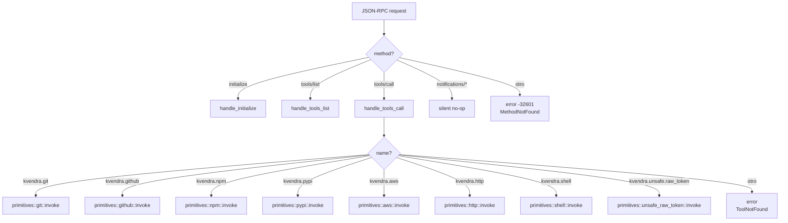
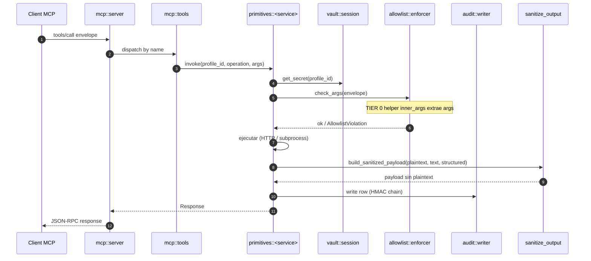

# 13. Servidor MCP

## Descripción

`kvendra mcp serve` arranca un proceso JSON-RPC 2.0 sobre stdio que implementa el subset del protocolo **MCP (Model Context Protocol)** necesario para que un cliente como Claude Code, Cursor, Cline o Continue invoque las primitives canónicas. El subprocess vive solo mientras el cliente lo necesita; cuando el cliente cierra stdin, el broker termina limpiamente.

Este capítulo cubre la implementación interna: protocolo, transport, dispatch de métodos, sanitización del payload y manejo de errores. La integración desde el lado del cliente está en el [capítulo 6](./06-uso-mcp-con-agentes.md).

## Decisión: thin JSON-RPC propio (no `rmcp`)

`ADR-KVD-006` formaliza la elección: implementación thin propia en lugar de adoptar el SDK comunitario `rmcp`. Razones:

> **Bajo coste eng** (~2-3 días para los métodos que necesitamos: `initialize`, `tools/list`, `tools/call`).
>
> **Sin dependencia de SDK joven** que aún tiene churn de API significativo.
>
> **Control total** sobre la sanitization del payload — `build_sanitized_payload` es nuestro y crítico.
>
> **Migración futura abierta**: si `rmcp` madura, la migración es local al módulo `mcp/` sin tocar primitives.

## Protocolo soportado

Versión MCP: la que negocia el cliente en `initialize`. `0.1.0` implementa el subset mínimo:

| Method | Direction | Status |
|--------|-----------|--------|
| `initialize` | client → server | implementado |
| `initialized` | client → server (notif) | aceptado, no-op server-side |
| `tools/list` | client → server | implementado |
| `tools/call` | client → server | implementado |
| `notifications/cancelled` | client → server (notif) | aceptado, no-op |
| Otros (`resources/*`, `prompts/*`) | — | no soportados en `0.1.0` |

El cliente solo necesita estos para el uso canónico: descubrir las primitives (`tools/list`) y ejecutarlas (`tools/call`).

## Transport — line-delimited JSON-RPC sobre stdio

`mcp::transport` es una capa fina sobre `tokio::io::AsyncBufReadExt`:

- Cada mensaje JSON-RPC es **una línea** de stdin/stdout.
- Encoding UTF-8.
- `Content-Length` headers (forma alternativa de framing MCP) **no** se soportan en `0.1.0` — todos los clientes probados (Claude Code, Cursor, Cline) usan line-delimited.

Pseudocódigo del loop principal:

```rust
let stdin = tokio::io::stdin();
let stdout = tokio::io::stdout();
let mut reader = BufReader::new(stdin).lines();

while let Ok(Some(line)) = reader.next_line().await {
    let request: JsonRpcRequest = match serde_json::from_str(&line) {
        Ok(r) => r,
        Err(e) => { write_parse_error(&stdout, e).await; continue; }
    };
    let response = dispatch(request).await;
    let json = serde_json::to_string(&response).unwrap();
    writeln!(stdout, "{}", json).await?;
}
```

Logs van a **stderr** — el cliente solo lee stdout, así que stderr es seguro para `tracing::info!` sin contaminar el protocolo.

## Dispatch

`mcp::server::dispatch` decide qué hacer según `request.method`:



## `initialize` — handshake

Request canónico:

```json
{
  "jsonrpc": "2.0", "id": 1, "method": "initialize",
  "params": {
    "protocolVersion": "2025-03-26",
    "clientInfo": { "name": "claude-code", "version": "1.x" },
    "capabilities": {}
  }
}
```

Response:

```json
{
  "jsonrpc": "2.0", "id": 1,
  "result": {
    "protocolVersion": "2025-03-26",
    "serverInfo": { "name": "kvendra", "version": "0.1.0" },
    "capabilities": { "tools": {} }
  }
}
```

El broker no anuncia capabilities `resources` ni `prompts` porque no las soporta. El cliente respeta el shape mínimo y no las pide.

## `tools/list` — catálogo

`mcp::tools::list_tools()` devuelve estáticamente las 8 primitives con sus `inputSchema` JSON Schema. El registry vive en `mcp/tools.rs`.

Cada entry tiene shape:

```json
{
  "name": "kvendra.<service>",
  "description": "...",
  "inputSchema": {
    "type": "object",
    "properties": {
      "profile_id": { "type": "string", ... },
      "operation": { "type": "string", "enum": [...] },
      "args": { "type": "object", ... }
    },
    "required": ["profile_id", "operation", "args"]
  }
}
```

La excepción `kvendra.unsafe.raw_token` lleva `description` con prefix `[UNSAFE]` (AC-PRIM-3) para que clientes MCP puedan renderizar warnings en su UI.

## `tools/call` — invocación

Flujo end-to-end (visto desde `mcp::server`):



## Sanitization canónica

**Patrón canónico de TODAS las primitives** (excepto el escape hatch):

> **Input:** `Option<&SecretPlaintext>` — smart pointer con `Drop` que zeroiza.
>
> **Output:** `sanitize_output()` recursivo aplicado a `text` + `structuredContent` antes de serializar la response al agente.
>
> **Helper canónico:** `mcp::server::build_sanitized_payload(plaintext, content_text, structured_content)` — constructor central que garantiza que ningún field del response contiene el plaintext.

Pseudocódigo:

```rust
pub fn build_sanitized_payload(
    plaintext: Option<&SecretPlaintext>,
    content_text: String,
    structured: serde_json::Value,
) -> McpResponse {
    let sanitized_text  = sanitize_recursive(&content_text, plaintext);
    let sanitized_struct = sanitize_json_recursive(&structured, plaintext);
    McpResponse {
        content: vec![McpContent::Text(sanitized_text)],
        structured_content: sanitized_struct,
        is_error: false,
    }
}
```

`sanitize_recursive` busca substring del plaintext (constant-time via `subtle::ConstantTimeEq` por chunks), y si encuentra match lo redacta a `[REDACTED:<n>chars]`. La detection layer ([capítulo 16](./16-detection-layer.md)) corre en paralelo y puede flagear/bloquear según severidad workspace.

> **Excepción documentada:** `kvendra.unsafe.raw_token` omite explícitamente este helper. Devuelve plaintext deliberadamente al agente. Audit-flagged unsafe; requiere opt-in explícito en el profile (`unsafe_raw_token_allowed: true`).

## Modelo de errores

Errores tipados (todos generan row en audit log con `status: error`):

| Error | Código JSON-RPC | Cuándo |
|-------|-----------------|--------|
| `ParseError` | -32700 | JSON inválido en stdin |
| `MethodNotFound` | -32601 | Method desconocido |
| `InvalidParams` | -32602 | Schema violation en `params` |
| `ToolNotFound` | -32602 | `tools/call` con `name` desconocido |
| `ProfileNotFound` | -32000 | `profile_id` no existe en vault |
| `ProfileExpired` | -32000 | Profile con `expiration < now` (AC-ALLOW-3) |
| `AllowlistViolation` | -32000 | Args fuera de scope (AC-PRIM-2) |
| `InvalidArgs` | -32000 | Args válidos según schema pero inválidos según primitive |
| `VaultLocked` | -32000 | Sesión expirada o no unlocked |
| `DetectionBlock` | -32000 | Detection severity `block` matched |
| `<Service>OperationFailed(stderr_sanitized)` | -32000 | El servicio externo falló (stderr filtrado) |

Códigos `-32000` son JSON-RPC server-defined; el cliente sabe distinguirlos por el `error.data.kind` que el broker rellena.

## Headers HTTP canónicos del broker

Cuando un primitive HTTP llama a un servicio externo (GitHub, npm, PyPI, HuggingFace), añade:

```
Authorization: Bearer <plaintext-from-profile>
Accept: application/vnd.<service>+json   (cuando aplica, ej. GitHub)
User-Agent: kvendra/<version>
```

El header `Authorization` se inyecta post-decrypt en el codepath del primitive, jamás en el del agente. Documentado en `IF-KVD-CLI-002` y similar para cada primitive.

## Performance target

`AC-MCP` no fija latencia, pero el success metric del REQ-KVD-002 sugiere:

> **Invocación de primitive típica** (`kvendra.github.read_repo`) **completa en ≤500 ms p95** (excluyendo latencia de red al servicio externo).

Lo que el broker añade encima de la latencia de red:

- Vault decrypt (RAM-only): ~100 µs.
- Allowlist enforcer (22 fields): ~50 µs.
- Audit write con HMAC: ~1-5 ms (SQLite WAL fsync depende de fs).
- Sanitize output (recursive sobre payload): O(n) sobre tamaño de la response, típicamente <1 ms para responses <100 KB.

El cuello de botella en producción es siempre la latencia de red, no el broker.

## Notas importantes

> **Nota:** El protocol version negotiated en `initialize` es la del cliente. El broker es compatible con versiones MCP que no introduzcan breaking changes en `tools/list` y `tools/call`. Si Anthropic publica un breaking en MCP, hay que bumpear `kvendra mcp serve` y posiblemente hacer feature gating por versión.

> **Advertencia:** Si modificas `mcp::server::build_sanitized_payload`, **acompáñalo de tests E2E que verifiquen `AC-MCP-3`** (plaintext jamás aparece en response). Es el invariante crítico del producto. Cualquier regresión es SECURITY/HIGH severity (ver `ISSUE-KVD-CLI-032` post-mortem por el shape mismatch que rompió 22 fields silenciosamente).
