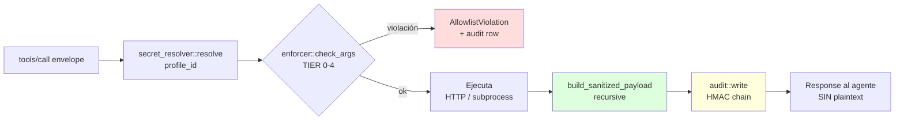

# 14. Primitives

## Descripción

Las **primitives** son el catálogo de operaciones que el broker expone vía MCP `tools/list`. Cada primitive es una **capability MCP canónica** del estilo `kvendra.<servicio>.<acción>`, mantenida por el core team de Kvendra. Cada una tiene una entidad formal en la Kvendra KB (`IF-KVD-CLI-001..008`).

0.6.4 mantiene **7 primitives canónicas + 1 escape hatch documentado** (8 en total, **25 operations**). Este capítulo describe cada una con sus operations, allowlist parameters relevantes, schema MCP y modelo de errores. Para uso desde el agente, ver el [capítulo 6](./06-uso-mcp-con-agentes.md). Para sintaxis del allowlist ver el [capítulo 7](./07-allowlist-dsl.md).

> **Fuente de verdad en tiempo de ejecución:** `kvendra capabilities --pretty` emite el manifest canónico (`broker_version`, `primitives`, `ops`, `destructive_ops`). Para inspección puntual, `kvendra primitive list` y `kvendra primitive info <name>` (el subcomando es `info`, no `show`).

## Lifecycle de una invocación



## Catálogo

| IF | Capability MCP | Servicio externo | Operations (0.6.4) |
|----|----------------|------------------|----------------------|
| `IF-KVD-CLI-001` | `kvendra.git` | binario `git` | `clone`, `push`, `pull`, `commit`, `tag` |
| `IF-KVD-CLI-002` | `kvendra.github` | GitHub REST + GraphQL | `update_repo`, `release`, `read_repo`, `read_issue`, `update_issue`, `add_topics`, `create_issue`, `list_issues` |
| `IF-KVD-CLI-003` | `kvendra.npm` | npm registry | `publish`, `deprecate`, `read_metadata` |
| `IF-KVD-CLI-004` | `kvendra.pypi` | PyPI Warehouse | `upload`, `read_metadata` |
| `IF-KVD-CLI-005` | `kvendra.aws` | AWS CLI / SDK | `s3_sync`, `s3_cp`, `cloudfront_invalidate`, `lambda_invoke` |
| `IF-KVD-CLI-006` | `kvendra.http` | HTTP genérico | `request` |
| `IF-KVD-CLI-007` | `kvendra.shell` | binarios shell constrained | `exec` |
| `IF-KVD-CLI-008` | `kvendra.unsafe.raw_token` | (escape hatch) | `get` |

## `kvendra.git`

`IF-KVD-CLI-001`. Invoca el binario `git` del sistema con auth configurada vía `credential.helper` efímero. El broker descifra el PAT, configura el helper para el subprocess y zeroiza tras `wait()`.

Operations:

| Operation | Allowlist parameters relevantes |
|-----------|--------------------------------|
| `clone` | `repos` (URL pattern allowlist) |
| `push` | `repos`, `refs` (deny `--force` por defecto) |
| `pull` | `repos`, `refs` |
| `commit` | `repos` (verifica que cwd corresponde a repo permitido) |
| `tag` | `repos`, `tag_pattern` |

Modelo de errores:

> `ProfileNotFound`, `ProfileExpired`, `AllowlistViolation`, `InvalidArgs`
>
> `RepoFormatInvalid(value)` — el parser rechazó el valor por no matchear `owner/name` ni URL forms.
>
> `GitOperationFailed` — stderr sanitizado para evitar leak del token.

Threat boundaries específicos:

- El plaintext jamás cruza el wire MCP.
- Errores de git que incluyan el token en stderr (raro) se sanitizan vía regex de detection antes de devolver.
- **0.6.4 — `clone` valida el esquema de la URL**: sólo `https`, `http`, `ssh`, `git` y la forma scp-like `git@host:path`. Cualquier otro esquema se rechaza antes de invocar `git`. El subprocess se lanza vía el spawner endurecido `primitives::spawn` (scrub de `KVENDRA_*` en el hijo). Ver [capítulo 18](./18-threat-model.md).

## `kvendra.github`

`IF-KVD-CLI-002`. REST + GraphQL contra `api.github.com`. Headers canónicos:

```
Authorization: Bearer <plaintext-token>
Accept: application/vnd.github+json
User-Agent: kvendra/<version>
```

Parser tolerante de `repo`: acepta `"owner/name"` y `"github.com/owner/name"` (con o sin `https://`). El parser canónico stripea el prefix.

Operations:

| Operation | API |
|-----------|-----|
| `update_repo` | `PATCH /repos/{owner}/{repo}` |
| `release` | `POST /repos/{owner}/{repo}/releases` |
| `read_repo` | `GET /repos/{owner}/{repo}` |
| `read_issue` | `GET /repos/{owner}/{repo}/issues/{number}` |
| `update_issue` | `PATCH /repos/{owner}/{repo}/issues/{number}` |
| `add_topics` | `PUT /repos/{owner}/{repo}/topics` |
| `create_issue` | `POST /repos/{owner}/{repo}/issues` |
| `list_issues` | `GET /repos/{owner}/{repo}/issues` |

Errores adicionales: `RepoFormatInvalid`, `GitHubAPIError(status, message_sanitized)`, `RateLimited(reset_at)`.

## `kvendra.npm`

`IF-KVD-CLI-003`. Invoca el binario `npm` con auth via env var `npm_config__authToken` temporal. La env var se zeroiza tras `wait()`.

Operations:

| Operation | Comando |
|-----------|---------|
| `publish` | `npm publish <pkg>` |
| `deprecate` | `npm deprecate <pkg>@<version> <message>` |
| `read_metadata` | `npm view <pkg> [field]` |

Errores: `NpmCommandFailed(stderr_sanitized)`, `PackageNotOwned`.

Threat boundaries: token solo en env var del subprocess; stderr sanitizado con regex de detection (npm tokens mismos patterns que el agente puede leakear).

> **0.6.4 — endurecimiento de `publish`:** el broker lanza `npm` con `--ignore-scripts` (evita RCE por lifecycle-scripts del cwd, finding N2) y con `--registry https://registry.npmjs.org/` pinneado en la CLI (evita que un `.npmrc` plantado redirija el `NPM_TOKEN` a un registry atacante, finding N6). Vía `primitives::spawn`. Ver [capítulo 18](./18-threat-model.md).

## `kvendra.pypi`

`IF-KVD-CLI-004`. Invoca `twine upload` (o endpoint REST PyPI Warehouse) con auth via env vars `TWINE_PASSWORD` / `TWINE_USERNAME=__token__`.

Operations:

| Operation | Comando |
|-----------|---------|
| `upload` | `twine upload dist/*` |
| `read_metadata` | `pip index versions <project>` o GET `/pypi/<project>/json` |

Errores: `PyPIUploadFailed(stderr_sanitized)`, `ProjectNotOwned`.

## `kvendra.aws`

`IF-KVD-CLI-005`. Invoca `aws` CLI con env vars `AWS_ACCESS_KEY_ID`, `AWS_SECRET_ACCESS_KEY`, `AWS_SESSION_TOKEN` (si aplica), `AWS_REGION`. El env del subprocess se construye via `Command::env_clear()` + sets explícitos para evitar contaminación cross-profile.

### Shapes aceptados del secret

> **Shape 1 — JSON canónico (preferido)**
>
> ```json
> {
>   "access_key_id": "AKIA...",
>   "secret_access_key": "...",
>   "session_token": "...",
>   "region": "us-west-1"
> }
> ```
>
> **Shape 2 — Colon-form (legacy / quick-paste)**
>
> - `"AKIAEXAMPLE:secretvalue"`
> - `"AKIAEXAMPLE:secretvalue:SESSIONTOKEN"`
>
> El parser detecta shape por primer carácter (`{` → JSON, otherwise → colon-form). En colon-form, `region` se hereda del allowlist.

Operations:

| Operation | Comando |
|-----------|---------|
| `s3_sync` | `aws s3 sync <local> s3://bucket/prefix` |
| `s3_cp` | `aws s3 cp <src> <dst>` |
| `cloudfront_invalidate` | `aws cloudfront create-invalidation --distribution-id <id> --paths <paths>` |
| `lambda_invoke` | `aws lambda invoke --function-name <fn> --payload <json>` |

Errores adicionales: `SecretShapeInvalid(reason)`, `AwsCommandFailed(stderr_sanitized, exit_code)`, `RegionMismatch`.

Threat boundaries: stderr sanitizado con regex extra para `AKIA[0-9A-Z]{16}` y secret access key heuristic. `delete: true` en `s3_sync` es una op destructiva: requiere `accept_destructive: true` en el allowlist (no existe un campo `delete_allowed`).

## `kvendra.http`

`IF-KVD-CLI-006`. Capability genérica para requests HTTP arbitrarias. Más flexible que las primitives específicas; **más restrictiva en allowlist** por ser genérica.

`auth_scheme` enum implementado en Pase B:

| `auth_scheme` | Header inyectado | Ejemplo |
|---------------|------------------|---------|
| `bearer` | `Authorization: Bearer <plaintext>` | OAuth2 / API token |
| `header_<NAME>` | `<NAME>: <plaintext>` | `header_X-Api-Key` → `X-Api-Key: <plaintext>` |
| `basic_<USER>` | `Authorization: Basic base64(<USER>:<plaintext>)` | `basic_admin` |
| `none` | (sin auth) | URLs públicas — requiere allowlist estricto |

Parser canónico (`primitives::http::auth`):

```rust
match auth_scheme.as_str() {
    "bearer" => Auth::Bearer,
    "none" => Auth::None,
    s if s.starts_with("header_") => Auth::Header(s[7..].to_string()),
    s if s.starts_with("basic_") => Auth::Basic(s[6..].to_string()),
    other => return Err(InvalidAuthScheme(other.to_string())),
}
```

Operation única: `request`. Schema input:

```json
{
  "method": "GET|POST|PUT|PATCH|DELETE|HEAD",
  "url": "...",
  "auth_scheme": "bearer|none|header_<NAME>|basic_<USER>",
  "headers": { ... },
  "body": "string|object|null"
}
```

> **0.6.4 — sin redirects automáticos:** el cliente usa `reqwest::redirect::Policy::none()`. Un `3xx` se devuelve verbatim al caller (status + headers) en lugar de seguirlo, porque el destino del `Location` nunca pasó por el allowlist (`ISSUE-KVD-CLI-B78ED5`). Si el agente necesita el destino, emite un follow-up explícito. Ya no existe el campo `follow_redirects`. Ver [capítulo 18](./18-threat-model.md).

Errores adicionales: `InvalidAuthScheme(value)`, `HttpRequestFailed(reason)`, `MethodNotAllowed(method)`, `UrlNotAllowed(url)`, `ForbiddenHeader(header)`.

Defaults restrictivos enforced en setup:

- `methods` vacío o ausente → rechazo al `secret set-allowlist` salvo `accept_broad_scope: true` en el YAML.
- `url_pattern_regex: ".*"` → rechazo.
- `Authorization` siempre forbidden al caller.
- `auth_scheme: none` requiere allowlist estricto.

## `kvendra.shell`

`IF-KVD-CLI-007`. Ejecuta binarios del sistema con args constrained. **No es shell-script execution** — es `Command::new(binary).args(...)` directo, sin `sh -c`, sin expansión de variables ni glob.

Operation única: `exec`. Schema input:

```json
{
  "binary": "gh",
  "argv": ["release", "create", "v0.6.4", "--repo", "KvendraAI/kvendra-cli"],
  "cwd": "/Users/x/Develop/kvendra-cli",
  "extra_env": { "FOO": "bar" }
}
```

Allowlist parameters relevantes: `binaries`, `args_constraints`, `cwd_pattern`, `env_vars_to_inject`, `forbidden_env_export_to_agent`.

Errores adicionales: `BinaryNotAllowed(binary)`, `ArgsConstraintViolation(arg)`, `ShellCommandFailed(exit_code, stderr_sanitized)`.

Threat boundaries críticos:

> **No expansión shell**: `Command::new(binary)` directo, no `sh -c`. Elimina inyección via `;`, `&&`, `|`, `$()`, backticks.
>
> **Allowlist match estricto**: cada arg del argv recibido se valida contra `args_constraints` (regex per-arg en orden).
>
> **Env vars del secret** se inyectan solo en el subprocess; no se devuelven al agente.
>
> **`cwd_pattern` mandatory**: previene ejecución en directorios arbitrarios; mitiga path traversal.
>
> **stdout/stderr sanitizados** con regex de detection antes de devolver al agente.

## `kvendra.unsafe.raw_token` — escape hatch

`IF-KVD-CLI-008`. **Viola la promesa zero-knowledge a propósito** — devuelve plaintext directamente al agente. Marcada como `unsafe` en `tools/list` (description prefix `[UNSAFE]`), audit-flagged, requiere opt-in explícito.

### Cuándo usar

> **Cuándo SÍ:** casos edge no cubiertos por las 7 primitives canónicas. Ejemplo legítimo: una API de un proveedor exótico cuyo SDK Rust no exista, sin endpoints HTTP-friendly, donde la única opción es darle el token al agente para lógica custom.
>
> **Cuándo NO:** nunca como atajo por pereza. Si una primitive canónica cubre el caso, usarla. La existencia del escape hatch es para no bloquear use-cases no cubiertos, no para saltarse la disciplina de capabilities.

### Schema input

```json
{
  "profile_id": "exotic-provider.api",
  "reason": "Provider X has no canonical kvendra primitive yet; calling proprietary SDK manually."
}
```

`reason` es field obligatorio, mínimo 10 chars, almacenado verbatim en audit log para auditoría forense.

### Defaults restrictivos

> `unsafe_raw_token_enabled` default `false`. El profile rechaza el call si no se activa explícitamente a `true`.
>
> `unsafe_max_uses_per_session` — quota por profile y sesión, aplicada por el contador del dispatcher.
>
> `kvendra secret add` requiere el flag `--unsafe-raw-token-enabled` para habilitar el escape hatch en ese profile.
>
> Recomendación: `expiration` corto (semanas, no meses).

### Audit hooks

Cada call → row con:

> `severity: warn`
>
> `flags: ["unsafe_escape_hatch"]`
>
> `reason` field stored verbatim
>
> `kvendra audit --watch` colorea estas rows en rojo. `kvendra audit --json` las marca con `"unsafe": true`.

### Threat boundaries explícitos

Una vez el plaintext está en el contexto del agente, ese plaintext puede:

- Quedar en logs del cliente MCP.
- Ser repetido en respuestas posteriores del agente.
- Filtrarse a backends LLM según el setup BYOK del usuario.

Mitigaciones documentadas:

- TTL corto en el profile.
- `unsafe_max_uses_per_session` low.
- Recomendación: rotar el token tras cada uso del escape hatch.
- Detection layer puede detectar ese token en mensajes futuros y marcarlo.

## Errores comunes a todas las primitives

Todos los primitives generan rows en audit log incluso cuando fallan. Set canónico de errores compartidos:

| Error | Cuándo | Audit severity |
|-------|--------|----------------|
| `ProfileNotFound` | `profile_id` no existe en vault | error |
| `ProfileExpired` | `expiration < now` | error |
| `AllowlistViolation` | Args fuera de scope | error |
| `InvalidArgs` | Schema violation o args inválidos | error |
| `<Service>OperationFailed(stderr_sanitized)` | Comando externo falló | error |
| `DetectionBlock` | Detection severity `block` matched | error |
| `RateLimited(reset_at)` | Servicio externo ratelimited | warn |

## Modelo de dispatch

No hay trait dinámico. Cada primitive expone una función de entrada del estilo:

```rust
pub async fn execute(
    args: &serde_json::Value,
    secret: Option<&SecretPlaintext>,
) -> KvendraResult<serde_json::Value>;
```

El dispatcher de `mcp::server` hace un `match` estático sobre el nombre de la capability (`"kvendra.github" => github::execute(args, secret).await`, …). Antes de llegar aquí ya se resolvió el secret (`secret_resolver`, local o broker remoto), se validó el allowlist (`enforcer::check_args`) y pasó detection + approval. Dentro de `execute`, `args["operation"]` despacha a la sub-función concreta. El catálogo estático para `tools/list` y `kvendra primitive list` es `primitives::catalog()` (`CATALOG: [PrimitiveInfo; 8]`).

## Notas importantes

> **Nota:** El catálogo de primitives es el moat técnico del producto. Cada primitive nueva (post-MVP en `kvendra-skills` marketplace) entrará tras review del core team con security audit, documentación de threat boundaries y tests E2E. La política está en `ROAD-KVD-005`.

> **Advertencia:** Si introduces una primitive nueva o modificas una existente, la regla es: **el plaintext jamás cruza al agente excepto en `kvendra.unsafe.raw_token`**. Cualquier desviación es SECURITY/HIGH severity. La revisión canónica de este invariante es `AC-MCP-3` del `REQ-KVD-002`.
