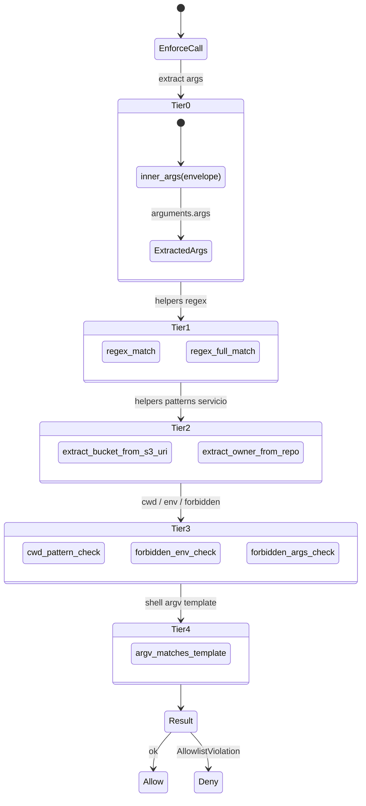

# 15. Allowlist enforcer

## Descripción

El **enforcer** (`allowlist::enforcer`) es el componente que ejecuta la validación runtime del allowlist contra los args reales de cada `tools/call`. Evalúa los campos del struct `OperationConstraints` (`src/allowlist/dsl.rs`) contra el envelope canónico `{profile_id, operation, args:{…}}`. Históricamente (pre-alpha.10) sólo 3 fields tenían branches y además sufrían un shape mismatch MCP (PAT-KVD-004 reapareciendo) que hacía el enforcement no-op en producción; la clase volvió en 0.6.3 como mismatch de **nombre de campo** y se cerró fail-closed en 0.6.4 (ver más abajo).

Este capítulo documenta el modelo en capas (TIER 0-4), las decisiones D1-D8 plasmadas inline en el código, la separación entre `validator` (setup-time) y `enforcer` (runtime), y cómo se cierra el shape MCP envelope.

Desde `0.4.0-alpha.5` el helper `glob_match` (Tier 1) acepta `*` como wildcard single-segment (`[^/]*`) en cualquier posición del pattern, no sólo como sufijo `/*`. Ver [Glob semantics](./07-allowlist-dsl.md#glob-semantics) en el capítulo 7 para la sintaxis y ejemplos canónicos. Aplica a `refs`, `buckets`, `distributions`, `functions`, `packages`, `projects`, `org` y `repos`/`repo`.

## Vista en capas



### TIER 0 — Helper `inner_args(envelope)`

El input al enforcer es el envelope MCP completo:

```json
{
  "name": "kvendra.github",
  "arguments": {
    "profile_id": "github.kvendraai.org-admin",
    "operation": "update_repo",
    "args": { "repo": "KvendraAI/kvendra-cli", "description": "..." }
  }
}
```

El enforcer necesita los args **internos** (`arguments.args`), no el envelope. **TIER 0 es el helper canónico que extrae correctamente esos args en TODAS las branches.** Este detalle aparentemente trivial es el que estaba roto pre-alpha.10: las 3 branches enforced (`forbidden_args`, `methods`, `repos`) miraban al envelope completo en lugar de a los inner args, lo que hacía que ningún regex match — el shape no era el esperado.

```rust
fn inner_args(envelope: &Value) -> Result<&Value, EnforcerError> {
    envelope
        .get("arguments")
        .and_then(|a| a.get("args"))
        .ok_or(EnforcerError::EnvelopeShapeInvalid)
}
```

Patrón canónico **PAT-KVD-004** post-mortem: cualquier nueva branch del enforcer debe usar `inner_args(envelope)` antes de evaluar campos.

### TIER 1 — Helpers regex

```rust
fn regex_match(pattern: &str, value: &str) -> bool { ... }
fn regex_full_match(pattern: &str, value: &str) -> bool { ... }
```

Reglas:

- `regex_match` permite match parcial (`Regex::is_match`).
- `regex_full_match` exige que el regex matchee el string completo (`^pattern$`).
- Ambos cachean los regex compilados internamente.

Decisión **D1**: el allowlist por defecto usa `regex_full_match` para evitar bypass por substring (ej. allowed `"refs/heads/main"` no debe matchear `"refs/heads/main-deletion"`).

### TIER 2 — Helpers de servicio

```rust
fn extract_bucket_from_s3_uri(uri: &str) -> Option<&str> { ... }
fn extract_owner_from_repo(repo: &str) -> Option<&str> { ... }
```

`extract_bucket_from_s3_uri`: `s3://kvendra-com-prod/path/to/file` → `kvendra-com-prod`. Usado por `kvendra.aws.s3_sync` y `s3_cp` para validar contra `buckets`.

`extract_owner_from_repo`: parser tolerante para `kvendra.github`. Acepta `"owner/name"`, `"github.com/owner/name"` o `"https://github.com/owner/name"` y devuelve `"owner"`. Decisión **D2**: el parser stripea prefix antes de fragmentar por `/`; validation: exactamente 2 segmentos no vacíos tras el strip.

### TIER 3 — Checks transversales

> **`cwd_pattern_check`** — `kvendra.shell` requiere que el cwd matchee un regex específico. Default rechaza si el campo está vacío o ausente; mitigación path traversal.
>
> **`forbidden_env_check`** — verifica que el agente no esté pidiendo inyectar env vars que el allowlist marca como forbidden export.
>
> **`forbidden_args_check`** — verifica que `argv` (en `kvendra.git`, `kvendra.shell`) no contenga args en la lista forbidden (ej. `--force` en push).

### TIER 4 — `argv_matches_template`

Validación de la sequence completa de argv contra los templates `args_constraints`:

```yaml
args_constraints:
  - allowed: ["release", "create", "v[0-9]+\\.[0-9]+\\.[0-9]+", "--repo", "KvendraAI/.+", "--title", ".+"]
  - allowed: ["release", "view", "v[0-9]+\\.[0-9]+\\.[0-9]+", "--repo", "KvendraAI/.+"]
```

Cada `allowed` es un template: el argv real se compara token-a-token contra los regex de la sequence (`regex_full_match` per token). Si todos los tokens matchean, el argv es válido. Si ninguno de los templates matchea, `ArgsConstraintViolation`.

Decisión **D3**: los templates son sequence-strict (orden importa). Decisión **D4**: el match es exhaustivo — extra tokens en argv que no aparecen en el template son rechazados.

## Los campos del DSL (struct `OperationConstraints`)

Los campos **válidos** del allowlist son EXACTAMENTE los del struct `OperationConstraints` en `src/allowlist/dsl.rs`, que lleva `#[serde(deny_unknown_fields)]`: **cualquier campo no listado hace fallar `secret set-allowlist`** (con pista «did you mean»). Distribución por primitive (los que el enforcer evalúa contra los args reales):

| Primitive | Fields | Helper |
|-----------|--------|--------|
| `kvendra.git` | `repos` / `repo` (alias, unión), `refs`, `tag_pattern`, `forbidden_args` | TIER 1, 3 |
| `kvendra.github` | `org`, `repo` / `repos`, `fields_allowed`, `forbidden_fields` | TIER 1, 2 |
| `kvendra.npm` | `packages` | TIER 1 |
| `kvendra.pypi` | `projects` | TIER 1 |
| `kvendra.aws` | `buckets`, `distributions`, `functions` | TIER 2 |
| `kvendra.http` | `url_pattern_regex`, `endpoints` (alias exacto, unión), `methods`, `forbidden_methods` | TIER 1, 3 |
| `kvendra.shell` | `binaries`, `args_constraints`, `cwd_pattern`, `env_vars_to_inject`, `forbidden_env_export_to_agent` | TIER 3, 4 |

Meta (cualquier primitive): `destructive`, `accept_destructive` (opt-in del owner; sin él, una op destructiva se rechaza al `set-allowlist`) y `accept_broad_scope` (**validator-time**, D7 — no runtime). A nivel de `PrimitiveAllow` (no de `OperationConstraints`) están los del escape hatch: `unsafe_raw_token_allowed`, `unsafe_max_uses_per_session` (default 1), `unsafe_reason_min_length` (default 10).

> **Corrección (vs versiones viejas del manual):** ediciones previas listaban `prefix_pattern`, `paths_pattern`, `delete_allowed`, `access`, `version_pattern`, `forbidden_tags`, `dist_pattern`, `forbidden_headers` y `max_body_size_kb`. **Ninguno existe** en el struct de 0.6.4 — usarlos rompe la firma del allowlist (`deny_unknown_fields`). Purgados de aquí y del [cap. 7](./07-allowlist-dsl.md).

> **La clase «campo que el primitive no manda» (0.6.4).** Aun con el nombre de campo correcto, en 0.6.3 tres checks leían un campo que el primitive real nunca envía → no-op silencioso: `binaries` leía `bin`, `repos` leía un `repo`/`url` del caller en vez de resolver el `remote`, y `tag_pattern` leía `tag` en vez de `name`. Cerrado fail-closed en 0.6.4 — ver la sección «0.6.4 — cierre fail-closed de la capa de autorización» más abajo.

## Meta-fields: validator vs enforcer (D7)

Algunos campos NO son enforcement runtime; son meta-flags de setup/catalog:

> **`accept_broad_scope`** — campo YAML **validator-time** (D7): permite firmar un allowlist con patrones de scope amplio (p. ej. un `url_pattern_regex` no host-específico). Se comprueba al `secret set-allowlist`, nunca en el enforcer. En 0.6.4 esa validación es **semántica por canarios** (ver [cap. 16](./16-detection-layer.md) y el validator), no literal.
>
> **`destructive`** — marca una operación como destructiva. En modo `ask-destructive` dispara el prompt de aprobación.
>
> **`accept_destructive`** — campo YAML opt-in del owner por operación (REQ-KVD-004): sin él, una operación marcada destructiva se **rechaza al `secret set-allowlist`**. NO es un flag de `mcp serve` (los flags reales de `mcp serve` son `--use-keychain`, `--password-env`, `--no-unlock`).

El enforcer solo evalúa los campos que impactan la decisión runtime de aceptar/rechazar; `accept_broad_scope` y `accept_destructive` se resuelven al firmar el allowlist.

## Decisiones inline D1-D8

Todas documentadas como doc-comments en `src/allowlist/dsl.rs`:

| Decisión | Resumen |
|----------|---------|
| **D1** | `repo` (singular) es alias de `repos` y se une con él (any-match, glob) |
| **D2** | `args_constraints` es un array de templates de argv; el argv de la call debe casar al menos uno (any-match, longitud estricta) |
| **D3** | `forbidden_env_export_to_agent` deniega claves env pedidas por la call ANTES del exec (defense-in-depth con el scrub de salida) |
| **D4** | `forbidden_methods` se AND-ea con `methods` (la denylist gana; fail-closed aunque `methods` lo permita) |
| **D5** | `buckets` extrae el nombre del `s3://NAME/...`; también acepta nombres de bucket pelados |
| **D6** | `endpoints` es alias exacto de las urls HTTP, unido con `url_pattern_regex` (any-match) |
| **D7** | `accept_broad_scope` se comprueba solo en validator-time, nunca en el enforcer |
| **D8** | Orden de checks: `is_expired → primitive → operation → denylists forbidden-first → allow-list` |

## Tests del enforcer

`tests/integration_aws_allowlist_boundary.rs` (file nuevo post alpha.10) contiene el regression canónico **AC-M2-6** que valida el shape MCP envelope correcto y la enforcement de las 22 fields.

Conteos:

- Tests pre-alpha.10: 204
- Tests post-alpha.10: 256 (+52)
- 5 tests adicionales en `src/allowlist/enforcer.rs` post fix `ISSUE-KVD-CLI-043` (gap permissive-on-absence en `clone url field`).

## Mitigaciones de threat model L1

El enforcer cierra estos vectores enumerados en Sesión 3 threat modeling:

> **GAP_4** — allowlist YAML modificable por atacante L1 + cache TOCTOU. Cerrado por **REQ-KVD-007** (alpha.6): HMAC sub-key `kvendra/allowlist-hmac/v1` + composite cache key con HMAC del YAML. Atacante con perms de user no puede modificar el YAML sin que el HMAC mismatch lo detecte al startup.

## 0.6.4 — cierre fail-closed de la capa de autorización (auditoría externa)

En 0.6.3 una auditoría estática externa (**Salva Ferrer**, avtn.es) y varios pases adversariales internos encontraron que la clase de bug que documenta **PAT-KVD-004 había vuelto en una forma más sutil**. En alpha.10 se arregló el *shape* del envelope (leer `inner_args`), pero varias branches seguían leyendo un **campo con el nombre equivocado** — uno que el primitive real nunca envía:

| Finding | Field que leía el enforcer | Field que manda el primitive | Efecto en 0.6.3 |
|---------|----------------------------|------------------------------|-----------------|
| **C2** | `bin` | `binary` (`kvendra.shell`) | `binaries:` no se comprobaba nunca |
| **N7** | `repo` / `url` | `{cwd, remote, ref}` (`kvendra.git` push/pull/tag/commit) | `repos:` saltado → push a cualquier repo |
| **N10** | `tag` | `name` (`kvendra.git tag`) | `tag_pattern` saltado |

Es el mismo *permissive-on-absence*: el campo no existe → el check se salta → allow. Y como en el C2 original, los **tests eran cómplices**: inyectaban el campo sintético (`bin`, `repo`, `tag`) que el primitive real no manda, así que pasaban en verde mientras producción estaba abierta (verde falso). N7 es el más grave: un agente con perfil git podía pushear cualquier checkout a **cualquier** repo, o poner `remote` a una URL de atacante, exfiltrando código privado y la credencial con el token GitHub del owner.

**Correcciones en 0.6.4** (todas fail-closed):

- **Nombre de campo compartido** primitive↔enforcer como constante única; si `binaries:` está declarado y falta `binary` en el payload → deny.
- **N7 — resolución del destino real de git**: el enforcer ya no confía en un `repo`/`url` del caller. Resuelve el destino real (la URL del `remote`, o el nombre de remote vía `git -C <cwd> remote get-url --push`, con host normalizado), lo casa contra `repos:` y **falla cerrado si no puede determinarlo**. El flujo legítimo `remote=origin` sigue pasando.
- **N10** — lee `name` para `tag_pattern` y falla cerrado si el pattern está declarado sin `name`.
- **C1 — `profile_id` vacío** era fail-open (saltaba allowlist y approval). Ahora todo primitive del catálogo es credential-bound → `profile_id` vacío es deny duro (`empty_profile_denied`). Un `profile_id` con `..`/`/` se rechaza (`invalid_profile_denied`, patrón `[A-Za-z0-9._-]`).
- **C4 — perfil con secreto y sin allowlist** era allow. Ahora es deny duro (`missing_allowlist_denied`).
- **D1 reforzada**: el match de `url_pattern_regex` se ancla al inicio de forma **incondicional** (`^(?:pattern)`), incluidas las ramas de alternación — antes un `is_match` por substring permitía `https://evil/?x=https://api.github.com/`, filtrando el token.

Detalle completo en `../security/advisory-cli-0.6.4.md`. Suite de regresión adversarial: `tests/security_audit_salva.rs` (roja en 0.6.3, verde en 0.6.4) + los `n7_*` en `cargo test --lib allowlist::enforcer`. Trazabilidad KB: `ISSUE-KVD-CLI-B78ED5` (cerrado), `REL-KVD-CLI-0.6.4`.

> **Lección (extiende PAT-KVD-004):** un test que inyecta un campo que el primitive real nunca manda da **verde falso** y esconde un enforcement no-op. Toda branch nueva del enforcer debe testearse con la **forma real** del envelope que produce el primitive, no con una sintética.

## Notas importantes

> **Nota:** El enforcer es el lugar donde el shape MCP envelope se canonicaliza. Si añades una primitive nueva o cambias el shape de `tools/call`, **acompáñalo de tests E2E que verifiquen los 22 fields contra el envelope final**, no contra los args internos. El bug histórico ISSUE-KVD-CLI-032 se debió a tests unitarios que pasaban con args internos pero el envelope real era distinto.

> **Advertencia:** Modificar `enforcer::check_args` requiere review especialmente cuidadoso. Una regresión que vuelva un field a no-op es SECURITY/HIGH. Tests de regresión obligatorios; la testsuite no debe poder pasar si una branch desaparece sin cobertura equivalente.
