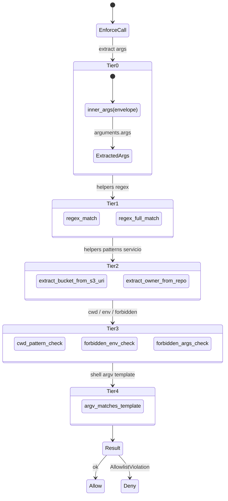

# 15. Allowlist enforcer

## Descripción

El **enforcer** (`allowlist::enforcer`) es el componente que ejecuta la validación runtime del allowlist contra los args reales de cada `tools/call`. En `0.1.0` post fix `ISSUE-KVD-CLI-032` cubre **22/22 fields del DSL** runtime-enforced. Pre-alpha.10 sólo 3 fields tenían branches y además sufrían un shape mismatch MCP (PAT-KVD-004 reapareciendo) que hacía el enforcement no-op en producción.

Este capítulo documenta el modelo en capas (TIER 0-4), las decisiones D1-D8 plasmadas inline en el código, la separación entre `validator` (setup-time) y `enforcer` (runtime), y cómo se cierra el shape MCP envelope.

Desde `0.4.0-alpha.5` el helper `glob_match` (Tier 1) acepta `*` como wildcard single-segment (`[^/]*`) en cualquier posición del pattern, no sólo como sufijo `/*`. Ver [Glob semantics](./07-allowlist-dsl.md#glob-semantics) en el capítulo 7 para la sintaxis y ejemplos canónicos. Aplica a `refs`, `buckets`, `distributions`, `functions`, `packages`, `projects`, `org` y `repos`/`repo`.

## Vista en capas



### TIER 0 — Helper `inner_args(envelope)`

El input al enforcer es el envelope MCP completo:

```json
{
  "name": "kvendra.github",
  "arguments": {
    "profile_id": "github.kvendraai.org-admin",
    "operation": "update_repo",
    "args": { "repo": "KvendraAI/kvendra-cli", "description": "..." }
  }
}
```

El enforcer necesita los args **internos** (`arguments.args`), no el envelope. **TIER 0 es el helper canónico que extrae correctamente esos args en TODAS las branches.** Este detalle aparentemente trivial es el que estaba roto pre-alpha.10: las 3 branches enforced (`forbidden_args`, `methods`, `repos`) miraban al envelope completo en lugar de a los inner args, lo que hacía que ningún regex match — el shape no era el esperado.

```rust
fn inner_args(envelope: &Value) -> Result<&Value, EnforcerError> {
    envelope
        .get("arguments")
        .and_then(|a| a.get("args"))
        .ok_or(EnforcerError::EnvelopeShapeInvalid)
}
```

Patrón canónico **PAT-KVD-004** post-mortem: cualquier nueva branch del enforcer debe usar `inner_args(envelope)` antes de evaluar campos.

### TIER 1 — Helpers regex

```rust
fn regex_match(pattern: &str, value: &str) -> bool { ... }
fn regex_full_match(pattern: &str, value: &str) -> bool { ... }
```

Reglas:

- `regex_match` permite match parcial (`Regex::is_match`).
- `regex_full_match` exige que el regex matchee el string completo (`^pattern$`).
- Ambos cachean los regex compilados internamente.

Decisión **D1**: el allowlist por defecto usa `regex_full_match` para evitar bypass por substring (ej. allowed `"refs/heads/main"` no debe matchear `"refs/heads/main-deletion"`).

### TIER 2 — Helpers de servicio

```rust
fn extract_bucket_from_s3_uri(uri: &str) -> Option<&str> { ... }
fn extract_owner_from_repo(repo: &str) -> Option<&str> { ... }
```

`extract_bucket_from_s3_uri`: `s3://kvendra-com-prod/path/to/file` → `kvendra-com-prod`. Usado por `kvendra.aws.s3_sync` y `s3_cp` para validar contra `buckets`.

`extract_owner_from_repo`: parser tolerante para `kvendra.github`. Acepta `"owner/name"`, `"github.com/owner/name"` o `"https://github.com/owner/name"` y devuelve `"owner"`. Decisión **D2**: el parser stripea prefix antes de fragmentar por `/`; validation: exactamente 2 segmentos no vacíos tras el strip.

### TIER 3 — Checks transversales

> **`cwd_pattern_check`** — `kvendra.shell` requiere que el cwd matchee un regex específico. Default rechaza si el campo está vacío o ausente; mitigación path traversal.
>
> **`forbidden_env_check`** — verifica que el agente no esté pidiendo inyectar env vars que el allowlist marca como forbidden export.
>
> **`forbidden_args_check`** — verifica que `argv` (en `kvendra.git`, `kvendra.shell`) no contenga args en la lista forbidden (ej. `--force` en push).

### TIER 4 — `argv_matches_template`

Validación de la sequence completa de argv contra los templates `args_constraints`:

```yaml
args_constraints:
  - allowed: ["release", "create", "v[0-9]+\\.[0-9]+\\.[0-9]+", "--repo", "KvendraAI/.+", "--title", ".+"]
  - allowed: ["release", "view", "v[0-9]+\\.[0-9]+\\.[0-9]+", "--repo", "KvendraAI/.+"]
```

Cada `allowed` es un template: el argv real se compara token-a-token contra los regex de la sequence (`regex_full_match` per token). Si todos los tokens matchean, el argv es válido. Si ninguno de los templates matchea, `ArgsConstraintViolation`.

Decisión **D3**: los templates son sequence-strict (orden importa). Decisión **D4**: el match es exhaustivo — extra tokens en argv que no aparecen en el template son rechazados.

## Las 22 fields runtime-enforced

Distribución por primitive:

| Primitive | Fields enforced | Fuente |
|-----------|-----------------|--------|
| `kvendra.git` | `repos`, `refs`, `tag_pattern`, `forbidden_args` | TIER 1, 3 |
| `kvendra.github` | `org`, `repo`, `fields_allowed`, `forbidden_fields` | TIER 1, 2 |
| `kvendra.npm` | `packages`, `access`, `version_pattern`, `forbidden_tags` | TIER 1 |
| `kvendra.pypi` | `projects`, `dist_pattern` | TIER 1 |
| `kvendra.aws` | `buckets`, `prefix_pattern`, `distributions`, `paths_pattern`, `functions`, `delete_allowed` | TIER 2 |
| `kvendra.http` | `url_pattern_regex`, `methods`, `forbidden_methods`, `forbidden_headers`, `max_body_size_kb` | TIER 1, 3 |
| `kvendra.shell` | `binaries`, `args_constraints`, `cwd_pattern`, `env_vars_to_inject`, `forbidden_env_export_to_agent` | TIER 3, 4 |

Total: **22 fields**. Todos enforced runtime via branches en `enforcer::check_args` post alpha.10. Antes del fix, sólo 3 (`forbidden_args`, `methods`, `repos`) tenían branches **y** sufrían shape mismatch — net effect: TODOS los 22 fields no-op en producción. SECURITY/HIGH gap.

## Separación validator vs enforcer (decisión D7)

3 fields meta NO viven en `enforcer`:

> **`accept_broad_scope`** — flag setup-time. Permite a `secret add` aceptar allowlists con `methods: []` o `url_pattern_regex: ".*"`. Vive en `validator.rs` y catalog.
>
> **`destructive`** — marca operations en el catálogo de primitives. Los primitives definen qué operaciones son destructivas (ej. `s3_sync` con `delete: true`).
>
> **`accept_destructive`** — flag CLI (`kvendra mcp serve --accept-destructive`) que permite ejecutar operaciones destructive. Vive en `policy.rs`.

Decisión D7: estos no son enforcement runtime per se; son meta-flags de setup/catalog/policy. El enforcer solo evalúa los 22 fields que sí impactan la decisión runtime de aceptar/rechazar la invocación.

## Decisiones inline D1-D8

Todas documentadas como doc-comments en `src/allowlist/dsl.rs`:

| Decisión | Resumen |
|----------|---------|
| **D1** | `regex_full_match` por defecto (evita bypass por substring) |
| **D2** | Repo parser tolerante: stripea `https://`, `github.com/` antes de fragmentar |
| **D3** | `args_constraints` templates son sequence-strict (orden importa) |
| **D4** | `args_constraints` exhaustivo (no permite extra tokens fuera del template) |
| **D5** | `prefix_pattern` para S3 acepta wildcard `/*` literal solo si está pinned a un bucket |
| **D6** | `version_pattern` para npm/pypi siempre `regex_full_match` |
| **D7** | `accept_broad_scope` / `destructive` / `accept_destructive` viven fuera del enforcer |
| **D8** | `forbidden_*` se evalúa **después** del positivo (`allowed_*`); negación gana |

## Tests del enforcer

`tests/integration_aws_allowlist_boundary.rs` (file nuevo post alpha.10) contiene el regression canónico **AC-M2-6** que valida el shape MCP envelope correcto y la enforcement de las 22 fields.

Conteos:

- Tests pre-alpha.10: 204
- Tests post-alpha.10: 256 (+52)
- 5 tests adicionales en `src/allowlist/enforcer.rs` post fix `ISSUE-KVD-CLI-043` (gap permissive-on-absence en `clone url field`).

## Mitigaciones de threat model L1

El enforcer cierra estos vectores enumerados en Sesión 3 threat modeling:

> **GAP_4** — allowlist YAML modificable por atacante L1 + cache TOCTOU. Cerrado por **REQ-KVD-007** (alpha.6): HMAC sub-key `kvendra/allowlist-hmac/v1` + composite cache key con HMAC del YAML. Atacante con perms de user no puede modificar el YAML sin que el HMAC mismatch lo detecte al startup.

## Notas importantes

> **Nota:** El enforcer es el lugar donde el shape MCP envelope se canonicaliza. Si añades una primitive nueva o cambias el shape de `tools/call`, **acompáñalo de tests E2E que verifiquen los 22 fields contra el envelope final**, no contra los args internos. El bug histórico ISSUE-KVD-CLI-032 se debió a tests unitarios que pasaban con args internos pero el envelope real era distinto.

> **Advertencia:** Modificar `enforcer::check_args` requiere review especialmente cuidadoso. Una regresión que vuelva un field a no-op es SECURITY/HIGH. Tests de regresión obligatorios; la testsuite no debe poder pasar si una branch desaparece sin cobertura equivalente.
