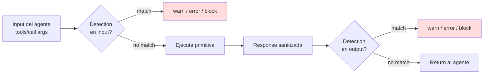

# 16. Detection layer

## Descripción

El **detection layer** es la red de seguridad **post-allowlist**: si por error un primitive devuelve algo que matchea pattern de token (ej. una API response que incluye un token raw), o si el agente envía un body con un token plaintext, el detection layer flagea o bloquea según la severidad configurada.

Es opt-in en el sentido de que la severidad por defecto (`warn`) no interrumpe operaciones — solo educa. El usuario puede subirla a `error` o `block` cuando quiera disciplina más estricta.

Este capítulo describe los patterns canónicos, las severidades workspace, la integración en el pipeline del broker y las heurísticas anti-falsos-positivos.

## Cuándo se ejecuta



Dos puntos de inspección:

> **Input** — antes de ejecutar el primitive. Detecta si el agente está mandando un token plaintext en el body de una request HTTP, en el commit message, en el argv del shell, etc.
>
> **Output** — tras `build_sanitized_payload`, justo antes del return al agente. Detecta si la response del servicio externo contiene un token (raro pero posible).

## Patterns canónicos

`detection::patterns` enumera los regex con clase de token:

| Provider | Regex |
|----------|-------|
| GitHub PAT classic | `ghp_[A-Za-z0-9]{36}` |
| GitHub fine-grained | `github_pat_[A-Za-z0-9_]{82}` |
| AWS Access Key | `AKIA[0-9A-Z]{16}` |
| JWT | `eyJ[A-Za-z0-9_=-]+\.[A-Za-z0-9_=-]+\.[A-Za-z0-9_.+/=-]+` |
| Anthropic | `sk-ant-[A-Za-z0-9_-]+` |
| OpenAI | `sk-[A-Za-z0-9]{48,}` |
| npm token | `npm_[A-Za-z0-9]{36,}` |
| HuggingFace | `hf_[A-Za-z0-9]{34,}` |
| PyPI | `pypi-AgEI[A-Za-z0-9_=-]+` |
| Generic high-entropy | `[A-Za-z0-9_-]{40,}` con entropy ≥4.5 bits/char (heurística Shannon) |

La heurística genérica (`generic_high_entropy`) cierra la cobertura para tokens de proveedores no listados explícitamente, mientras minimiza falsos positivos sobre identificadores normales (UUIDs, nombres de fichero, hashes git).

## Severidades workspace

Configurable via `kvendra config set detection.severity <warn|error|block>`. Persiste en `config.toml` (firmado con HMAC sidecar — `kvendra/config-hmac/v1` — para resistir tampering L1).

| Severity | Comportamiento input | Comportamiento output | Audit row |
|----------|---------------------|----------------------|-----------|
| `warn` | Loguea warning, deja pasar | Loguea warning, devuelve al agente | `severity: warn`, `flags: ["detection_match"]` |
| `error` | Loguea + agrega `isError: true` al MCP response | Idem | `severity: error` |
| `block` | Rechaza con `DetectionBlock`, no ejecuta primitive | Rechaza response, devuelve `DetectionBlock` | `severity: error`, `flags: ["detection_block"]` |

Default `warn`. Para developers sólos en alpha cerrada, `warn` es suficiente — educa sin imponer fricción. Para entornos compartidos o equipos con disciplina más alta, `error` o `block`.

## Heurística anti-falsos-positivos

Cubre **AC-DETECT-3** del REQ-KVD-002:

1. **Longitud mínima**: matches de menos de 20 chars se ignoran salvo que el pattern lo exija (ej. `ghp_*` exige 36).
2. **Entropy check**: para `generic_high_entropy`, calcula Shannon entropy. Strings con entropy <4.5 bits/char se descartan (típico para hashes git que matchean `[A-Za-z0-9]{40}` pero tienen entropy más baja).
3. **Allowlist contextual**: strings que aparecen rodeados de `<example>`, `// example`, `<placeholder>` o markers similares se ignoran (común en docs y readmes).

Si una primitive genera matches falsos positivos repetidos, la lección se documenta en `PAT-KVD-*` y el regex se ajusta.

## Mensaje educativo

Cuando un match dispara warning, el log y la audit row incluyen un mensaje human-readable:

> *"This looks like a `<provider>` token. Want to store it via `kvendra secret import <provider>` and use the capability broker instead?"*

Tono: educativo, no punitivo. Sugiere la alternativa (importar al vault), no se limita a bloquear.

## Integración en el pipeline

`mcp::server` invoca el detection layer en dos puntos:

```rust
// Input check
if let Some(matches) = detection::scan(&request_args) {
    apply_severity(matches, &workspace.severity, AuditPoint::Input).await?;
}

let response = primitive::invoke(...).await?;

// Output check (después de sanitize_output)
if let Some(matches) = detection::scan(&response.content) {
    apply_severity(matches, &workspace.severity, AuditPoint::Output).await?;
}

Ok(response)
```

`apply_severity` es el dispatcher que decide warn/error/block según la config y escribe la audit row apropiada.

## Pre-commit hook (post-MVP)

Future: `kvendra git secret-scan` como pre-commit hook que escanea el diff antes de permitir el commit. Documentado como out-of-scope del REQ-KVD-002 — extension natural cuando llegue Pro tier.

## Tests del detection layer

Conjunto típico:

- Cada pattern canónico tiene happy-path (token sintético matchea) y edge-case (no falso positivo en string parecido pero no-token).
- Heurística generic_high_entropy: tests con UUIDs, hashes git SHA-1/SHA-256 (no deben matchear con entropy real) y tokens random (sí deben matchear).
- Severity dispatch: cada nivel produce el comportamiento correcto end-to-end.

## Relación con sanitize_output

`detection` y `sanitize_output` son complementarios:

> `sanitize_output` redacta el plaintext **conocido** (el secret del profile activo) en el response.
>
> `detection` busca patterns **genéricos** de tokens en input/output, sin saber cuál es el secret activo.

Si una response del servicio externo contiene un token de **otro** servicio (ej. la API de GitHub devuelve un body con un AWS key embebido por error), `sanitize_output` no lo redactará (no es el plaintext del profile actual), pero `detection` sí lo flageará si la severidad es `error` o `block`.

## Notas importantes

> **Nota:** El detection layer **no sustituye** la disciplina de allowlist. Es defense-in-depth. Si tu allowlist YAML está bien escrito, los tokens no deberían cruzar el broker en plaintext en ninguna dirección — el detection layer es el avisador de cuando algo se ha colado.

> **Advertencia:** No pongas severidad `block` si tu workflow incluye operaciones legítimas que generan strings de alta entropía (ej. signatures HMAC visibles en debug logs, IDs de transactions criptográficos largos). El detection layer puede dar falsos positivos sobre strings legítimos pero "token-like". El balance default (`warn`) es deliberado.
