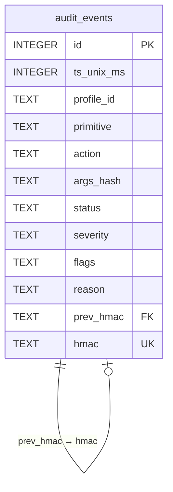

# 17. Audit internals

## Descripción

El audit log de Kvendra (`~/.kvendra/audit.db`) es una base SQLite WAL-mode con HMAC chain entre rows. Este capítulo describe el schema, la derivación de la sub-key HMAC, el patrón de write-before-respond, la verificación cross-process y las decisiones de diseño que justifican la elección de SQLite + HMAC en lugar de alternativas (append-only logs, signed JSON, etc.).

El uso desde la línea de comandos (`kvendra audit`, `--watch`, `--json`, `--verify`) está en el [capítulo 8](./08-audit-log.md).

## Decisión de stack

`ADR-KVD-007` formaliza la elección de `rusqlite` (sync, simple, `bundled` feature) sobre `sqlx` (async, runtime-agnostic). Razones:

> **`bundled`** evita dependencia de SQLite del sistema; build reproducible.
>
> **Sync simple** — el audit log se accede via `tokio::task::spawn_blocking` cuando el contexto es async. No necesitamos las features avanzadas de `sqlx`.
>
> **Tamaño** — `rusqlite + bundled` añade ~2 MB al binario. Aceptable.
>
> **Estabilidad** — `rusqlite` es maduro; menos churn que `sqlx`.

## Schema

```sql
CREATE TABLE audit_events (
    id              INTEGER PRIMARY KEY AUTOINCREMENT,
    ts_unix_ms      INTEGER NOT NULL,
    profile_id      TEXT,
    primitive       TEXT NOT NULL,
    action          TEXT NOT NULL,
    args_hash       TEXT NOT NULL,         -- sha256:<hex>
    status          TEXT NOT NULL,         -- 'ok' | 'error_<class>'
    severity        TEXT NOT NULL,         -- 'info' | 'warn' | 'error'
    flags           TEXT,                  -- JSON array of strings
    reason          TEXT,                  -- nullable, used by unsafe.raw_token
    prev_hmac       TEXT,                  -- hex, NULL for genesis row
    hmac            TEXT NOT NULL          -- hex
);

CREATE INDEX idx_audit_ts ON audit_events(ts_unix_ms);
CREATE INDEX idx_audit_profile ON audit_events(profile_id);
CREATE INDEX idx_audit_primitive ON audit_events(primitive);
```

Diagrama relacional:



`prev_hmac` apunta al `hmac` de la row anterior. La row 1 (genesis) tiene `prev_hmac = NULL`.

## WAL mode

```sql
PRAGMA journal_mode = WAL;
PRAGMA synchronous = NORMAL;
```

Tradeoff:

> **WAL** permite lecturas concurrentes mientras hay escrituras (útil para `--watch` mientras el broker escribe).
>
> **`synchronous = NORMAL`** balance entre durabilidad y latencia. En `0.1.0` priorizamos latencia: el coste de un crash post-write con datos parcialmente flushed es perder las últimas N rows, no corromper el log entero.

Para casos donde la durabilidad es crítica (entornos enterprise), `synchronous = FULL` es ajustable post-MVP.

## Derivación de la sub-key HMAC

La sub-key HMAC del audit log se deriva del Argon2id-derived vault key vía HKDF-SHA256:

```rust
pub const HKDF_INFO_AUDIT_HMAC: &str = "kvendra/audit-hmac/v1";

let audit_subkey = hkdf::Hkdf::<Sha256>::new(None, &derived_key);
let mut sub_key = [0u8; 32];
audit_subkey.expand(HKDF_INFO_AUDIT_HMAC.as_bytes(), &mut sub_key)?;
```

Localización canónica: `vault::session::HKDF_INFO_AUDIT_HMAC`.

**Razón**: separar dominios criptográficos. La derived key cifra blobs; una sub-key derivada con info distinto firma el audit chain. Si en el futuro se añade backup encryption con su propia sub-key, tendrá info `kvendra/backup-key/v1`. El sufijo `/v1` permite rotación sin breaking change.

## Cálculo del HMAC por row

Para cada row `i`:

```
payload_i = serialize_canonical({
  id_i, ts_unix_ms_i, profile_id_i, primitive_i, action_i,
  args_hash_i, status_i, severity_i, flags_i, reason_i,
  prev_hmac_i
})

hmac_i = HMAC-SHA256(audit_subkey, payload_i)
```

Donde `serialize_canonical` produce un encoding determinístico (orden de campos fijo, sin espacios, sin diferencias por compilador). Se usa una serialización custom (no `serde_json::to_string`, que no garantiza canonicalidad).

Para la genesis row (`id = 1`), `prev_hmac = ""` (string vacío) y `hmac` se calcula igual.

## Write-before-respond (AC-AUDIT-1)

Cada `tools/call`, **incluso fallido por allowlist**, escribe row antes de devolver respuesta al agente:

```rust
async fn invoke_with_audit(
    primitive: &dyn McpPrimitive,
    args: &Value,
    audit: &AuditWriter,
) -> McpResponse {
    let result = primitive.invoke(args).await;
    let row = build_audit_row(&result, args);
    audit.write(row).await?;  // Falla aquí aborta toda la response.
    response_from(result)
}
```

Si el write falla (disco lleno, fs corrupto), la primitive devuelve `AuditWriteFailed` al cliente — no hay degradación silenciosa del logging. Decisión deliberada: integridad del audit chain >> disponibilidad del primitive.

## Verificación cross-process (`audit verify`)

`kvendra audit --verify` requiere acceso a la sub-key HMAC, que vive solo en RAM del proceso `kvendra mcp serve`. Para evitar tener un daemon extra o depender del keychain, el comando re-deriva la sub-key in-process aceptando el password por **3 canales** (en orden de preferencia):

1. `--password-stdin` — preferido (no aparece en process listing).
2. `KVENDRA_PASSWORD` env var — para CI / scripts. **Sub-vector O1 expandido**: visible en `/proc/<pid>/environ` y `ps eww` durante la duración del comando. Trade-off documentado.
3. Prompt TTY — para uso interactivo (requiere TTY).

Tras el verify, todos los buffers que tocaron password / derived key / sub-key se zeroizan inmediatamente. Mantiene zero-knowledge puro: ningún canal persiste el password fuera del proceso.

## Algoritmo de verify

```rust
fn verify_chain(db: &Connection, audit_subkey: &[u8]) -> Result<(), VerifyError> {
    let mut prev_hmac = String::new();
    let mut stmt = db.prepare("SELECT * FROM audit_events ORDER BY id ASC")?;
    let mut rows = stmt.query([])?;

    while let Some(row) = rows.next()? {
        let stored_hmac: String = row.get("hmac")?;
        let stored_prev: Option<String> = row.get("prev_hmac")?;

        // Continuidad de la chain
        if stored_prev.unwrap_or_default() != prev_hmac {
            return Err(VerifyError::ChainBroken {
                row_id: row.get("id")?,
                cause: "prev_hmac mismatch with previous row's hmac",
            });
        }

        // Recalcular HMAC esperado
        let payload = serialize_canonical_row(&row, &prev_hmac)?;
        let expected = hmac_sha256(audit_subkey, &payload);

        if expected.to_hex() != stored_hmac {
            return Err(VerifyError::ChainBroken {
                row_id: row.get("id")?,
                cause: "hmac mismatch (row tampered or schema migration drift)",
            });
        }

        prev_hmac = stored_hmac;
    }

    Ok(())
}
```

Time complexity: O(n) sobre número de rows. Para `audit.db` de ~10k rows, completa en <1 s en hardware moderno.

## Migraciones de schema

Cuando un nuevo binario altera el schema (ej. añade un campo nuevo), la sub-key HMAC sigue siendo válida porque está derivada de la vault key, no de los datos. Pero el `serialize_canonical` puede cambiar — si añades un campo nuevo, las rows antiguas seguirían validando si el campo no se incluye en su payload original.

Patrón canónico:

> **Add-only**: nuevos campos se añaden al schema y al `serialize_canonical`, pero rows pre-migración no incluyen el campo en su recálculo (el campo será NULL para esas rows; el serializer canónico omite NULLs en filas pre-migración).
>
> **Migration row**: alpha.11 introdujo `allowlist_hmac_migrated` como audit row dedicada que documenta la migración. Cualquier salto de schema futuro se acompaña de una row similar para evidencia.
>
> **Bumping `/v1`**: si una migración rompe la canonicalidad de las rows antiguas, se bumpea la info HKDF (`kvendra/audit-hmac/v2`). Las rows antiguas requieren migración explícita para re-firmarse con la sub-key v2.

## Inspección directa SQLite

`kvendra audit --json` no requiere unlock; es texto plain. Para uso con `sqlite3` directo (cuando el binario `kvendra` no está disponible):

```bash
sqlite3 ~/.kvendra/audit.db "SELECT id, ts_unix_ms, profile_id, primitive, action, status, severity, flags FROM audit_events ORDER BY id DESC LIMIT 10"
```

Esta es la ruta canónica del agente — leer audit log raw sin password (las rows son texto plain; el HMAC chain es metadata aparte). Solo `--verify` requiere master password. Patrón documentado en `CLAUDE.md` del workspace.

## Performance

| Operación | Latencia típica |
|-----------|-----------------|
| Write de una row (con HMAC) | 1-5 ms (depende fsync) |
| Read paginado (100 rows) | <1 ms |
| `--watch` polling | <500 ms (AC-TUI-2) |
| `--verify` 1k rows | <100 ms |
| `--verify` 10k rows | <1 s |

## Vector L1 mitigado

> **GAP_4** — allowlist YAML modificable por atacante L1. **Cerrado parcialmente** por audit write-before-respond: aunque GAP_4 es específicamente del allowlist HMAC sidecar (capítulo aparte), el audit log también participa: si un atacante altera el allowlist YAML manualmente y consigue saltarse el sidecar, el primer `tools/call` con un profile afectado deja una row en audit que delata la actividad.

## Notas importantes

> **Nota:** El audit log no rota automáticamente en `0.1.0`. Para entornos enterprise con retention policies, la rotación gestionada llega en Team tier (post-MVP). La fricción manual: archivar `audit.db` periódicamente y dejar uno nuevo. La continuidad de la chain entre archivos no se preserva en este flujo manual — es trade-off aceptado.

> **Advertencia:** Nunca uses `BEGIN; ... COMMIT;` para insertar múltiples rows juntas. Cada row necesita su `prev_hmac` resuelto antes de calcular su `hmac`. Insertar batch sin secuencializar HMAC rompería la chain.
