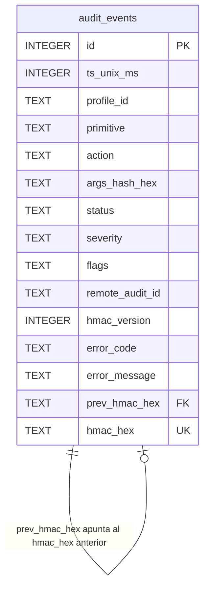

# 17. Audit internals

## Descripción

El audit log de Kvendra (`~/.kvendra/audit.db`) es una base SQLite WAL-mode con HMAC chain entre rows. Este capítulo describe el schema (v1 → v2 → v3), la derivación de la sub-key HMAC, el patrón de write-before-respond, la verificación cross-process y las decisiones de diseño que justifican la elección de SQLite + HMAC en lugar de alternativas (append-only logs, signed JSON, etc.).

El uso desde la línea de comandos (`kvendra audit` con los flags `--verify` / `--json` / `--watch` / `--since` / `--profile` / `--primitive`, y los subcomandos `audit export` / `audit verify-export`) está en el [capítulo 8](./08-audit-log.md).

## Decisión de stack

`ADR-KVD-007` formaliza la elección de `rusqlite` (sync, simple, `bundled` feature) sobre `sqlx` (async, runtime-agnostic). Razones:

> **`bundled`** evita dependencia de SQLite del sistema; build reproducible.
>
> **Sync simple** — el audit log se accede via `tokio::task::spawn_blocking` cuando el contexto es async. No necesitamos las features avanzadas de `sqlx`.
>
> **Tamaño** — `rusqlite + bundled` añade ~2 MB al binario. Aceptable.
>
> **Estabilidad** — `rusqlite` es maduro; menos churn que `sqlx`.

## Schema

Schema base v1 (`src/audit/schema.rs`), con las columnas que añaden las migraciones v2 y v3:

```sql
-- v1 baseline
CREATE TABLE audit_events (
    id              INTEGER PRIMARY KEY AUTOINCREMENT,
    ts_unix_ms      INTEGER NOT NULL,
    profile_id      TEXT NOT NULL,
    primitive       TEXT NOT NULL,
    action          TEXT NOT NULL,
    args_hash_hex   TEXT NOT NULL,                 -- hex del SHA-256 de los args
    status          TEXT NOT NULL,                 -- 'started' | 'ok' | 'error'
    severity        TEXT NOT NULL,                 -- 'info' | 'warn' | 'error'
    flags           TEXT NOT NULL DEFAULT '',
    prev_hmac_hex   TEXT NOT NULL DEFAULT '',      -- hex, '' en la genesis row
    hmac_hex        TEXT NOT NULL                  -- hex
);
CREATE INDEX idx_audit_ts ON audit_events(ts_unix_ms);
CREATE INDEX idx_audit_profile ON audit_events(profile_id);

-- v2 (migración): correlación remota + versión de layout HMAC por row
ALTER TABLE audit_events ADD COLUMN remote_audit_id TEXT NULL;
ALTER TABLE audit_events ADD COLUMN hmac_version INTEGER NOT NULL DEFAULT 1;

-- v3 (migración, ISSUE-KVD-CLI-6C43AA): diagnóstico de errores commit al chain
ALTER TABLE audit_events ADD COLUMN error_code    TEXT NULL;  -- taxonomía cerrada
ALTER TABLE audit_events ADD COLUMN error_message TEXT NULL;  -- sanitizado, ≤512 chars
CREATE INDEX idx_audit_error_code ON audit_events(error_code) WHERE error_code IS NOT NULL;
```

Diagrama relacional:



`prev_hmac_hex` apunta al `hmac_hex` de la row anterior. La row 1 (genesis) tiene `prev_hmac_hex = ""` (string vacío, no `NULL`).

## WAL mode

```sql
PRAGMA journal_mode = WAL;
PRAGMA synchronous = NORMAL;
```

Tradeoff:

> **WAL** permite lecturas concurrentes mientras hay escrituras (útil para `--watch` mientras el broker escribe).
>
> **`synchronous = NORMAL`** balance entre durabilidad y latencia: el coste de un crash post-write con datos parcialmente flushed es perder las últimas N rows, no corromper el log entero. (`init` también fija `foreign_keys = ON` y `temp_store = MEMORY`.)

Para casos donde la durabilidad es crítica (entornos enterprise), `synchronous = FULL` es ajustable post-MVP.

## Derivación de la sub-key HMAC

La sub-key HMAC del audit log se deriva del Argon2id-derived vault key vía HKDF-SHA256:

```rust
pub const HKDF_INFO_AUDIT_HMAC: &str = "kvendra/audit-hmac/v1";

let audit_subkey = hkdf::Hkdf::<Sha256>::new(None, &derived_key);
let mut sub_key = [0u8; 32];
audit_subkey.expand(HKDF_INFO_AUDIT_HMAC.as_bytes(), &mut sub_key)?;
```

Localización canónica: `vault::session::HKDF_INFO_AUDIT_HMAC`.

**Razón**: separar dominios criptográficos. La derived key cifra blobs; una sub-key derivada con info distinto firma el audit chain. En `0.6.4` conviven 6 sub-keys HKDF (audit, allowlist, config, grant-sign, session-wrap, backup-cipher — ver [capítulo 12](./12-vault-criptografia.md)); el backup usa `kvendra/backup-cipher/v1`. El sufijo `/v1` permite rotación sin breaking change.

## Cálculo del HMAC por row

Para cada row, el HMAC se computa sobre una **concatenación byte a byte** de los campos separados por `|` (`src/audit/hmac.rs`), no sobre JSON. Los enteros (`id`, `ts_unix_ms`) entran en **big-endian**; el resto como bytes UTF-8. Hay tres layouts que coexisten en disco, elegidos por la columna `hmac_version` de cada row:

```
// v1 (alpha.1..0.1.0)
payload = id_be | "|" | ts_be | "|" | profile_id | "|" | primitive | "|"
        | action | "|" | args_hash_hex | "|" | status | "|" | severity
        | "|" | flags | "|" | prev_hmac_hex

// v2 (0.3.0+): añade remote_audit_id al final
payload_v2 = payload | "|" | remote_audit_id?

// v3 (audit v3): añade error_code y error_message al final
payload_v3 = payload | "|" | remote_audit_id? | "|" | error_code? | "|" | error_message?

hmac = HMAC-SHA256(audit_subkey, payload)   // hex-encoded
```

Cada `Option` (`remote_audit_id`, `error_code`, `error_message`) que es `None` **se canonicaliza al string vacío**, así que un row v3 sin error sigue anexando los separadores `|""|""` y nunca colisiona con un row v2. Las inserciones nuevas usan v3 (`hmac_version = 3`); los rows anteriores conservan su `hmac_version` y por tanto su HMAC original, de modo que una migración de schema **no** re-firma el histórico.

Para la genesis row, `prev_hmac_hex = ""` (string vacío) y el `hmac` se calcula igual.

## Write-before-respond (AC-AUDIT-1)

Por AC-AUDIT-1, el broker registra el evento (status `started` al iniciar; el resultado terminal `ok` / `error` — este último con su `error_code` + `error_message`), **incluso si el call se rechaza por allowlist**, antes de devolver respuesta al agente:

```rust
// Ilustrativo — mcp::server (dispatch estático por nombre; NO hay trait de primitive)
async fn dispatch_with_audit(name: &str, args: &Value, secret: Option<&SecretPlaintext>, audit: &AuditWriter) -> McpResponse {
    audit.write(started_row(name, args)).await?;   // status "started" ANTES de ejecutar (incluso si luego se deniega)
    let result = match name {                       // cada primitive es `execute(args, secret)`
        "kvendra.git"    => git::execute(args, secret).await,
        "kvendra.github" => github::execute(args, secret).await,
        // … resto de primitives + kvendra.unsafe.raw_token
        _ => Err(KvendraError::MethodNotFound),
    };
    audit.write(terminal_row(&result)).await?;      // "ok" / "error" (+ error_code/error_message). Falla aquí = aborta la response.
    response_from(result)
}
```

Si el write falla (disco lleno, fs corrupto), la primitive devuelve `AuditWriteFailed` al cliente — no hay degradación silenciosa del logging. Decisión deliberada: integridad del audit chain >> disponibilidad del primitive.

## Verificación cross-process (`audit --verify`)

`kvendra audit --verify` (flag, no subcomando) requiere acceso a la sub-key HMAC, que se deriva de la vault key. Para evitar tener un daemon extra o depender del keychain, el comando re-deriva la sub-key in-process aceptando el password por **3 canales** (en orden de preferencia):

1. `--password-stdin` — preferido (no aparece en process listing).
2. `KVENDRA_PASSWORD` env var — para CI / scripts. **Sub-vector O1 expandido**: visible en `/proc/<pid>/environ` y `ps eww` durante la duración del comando. Trade-off documentado.
3. Prompt TTY — para uso interactivo (requiere TTY).

Tras el verify, todos los buffers que tocaron password / derived key / sub-key se zeroizan inmediatamente. Mantiene zero-knowledge puro: ningún canal persiste el password fuera del proceso.

## Algoritmo de verify

```rust
// src/audit/reader.rs — verify_chain
pub fn verify_chain(conn: &Connection, hmac_key: &[u8]) -> KvendraResult<()> {
    let events = list_all(conn)?;                 // ORDER BY id ASC
    let mut prev = String::new();                 // genesis: prev = ""
    for ev in events {
        // 1) Continuidad de la chain
        if ev.prev_hmac_hex != prev {
            return Err(KvendraError::AuditChainBroken(ev.id));
        }
        // 2) Recalcular con el layout que declara la propia row
        let recomputed = match ev.hmac_version {
            v if v >= 3 => compute_hmac_v3(hmac_key, /* … */ ev.error_code, ev.error_message),
            2           => compute_hmac_v2(hmac_key, /* … */ ev.remote_audit_id),
            _           => compute_hmac_v1(hmac_key, /* … */),
        };
        if recomputed != ev.hmac_hex {
            return Err(KvendraError::AuditChainBroken(ev.id));
        }
        prev = ev.hmac_hex;
    }
    Ok(())
}
```

Recorre los rows en orden de `id`, verifica la continuidad (`prev_hmac_hex` == `hmac_hex` anterior) y recomputa el HMAC con el `compute_hmac_vN` que corresponde a la `hmac_version` de cada row. Time complexity O(n); para ~10k rows completa en <1 s.

> **Residual N4 (0.6.4):** este algoritmo detecta **edición, inserción y reordenado** de rows (rompen la continuidad o el recálculo), pero **no** detecta el **truncado por la cola**: borrar los últimos rows deja una cadena que sigue verificando. El anclaje del final del log (contador firmado / checkpoint) es un quick-win de la Fase 0 del roadmap. `ISSUE-KVD-CLI-DA52A0`. Ver [capítulo 18](./18-threat-model.md).

## Migraciones de schema

Las migraciones (`src/audit/migrations.rs`) son **idempotentes** y se aplican **lazy en cada arranque** desde `schema::init` (`apply_pending`). Un ledger `schema_migrations (version, applied_at)` dedup las ya aplicadas; un binario nuevo aplica los pasos pendientes sin runner externo. La sub-key HMAC no cambia (deriva de la vault key, no de los datos).

Patrón canónico:

> **Add-only, NULL-safe**: cada paso hace `ALTER TABLE ADD COLUMN … NULL` (o con default). Las rows presentes conservan su `hmac_version` y su HMAC original — los bytes que consumió su `compute_hmac_vN` no cambian. Las columnas `Option` (`remote_audit_id`, `error_code`, `error_message`) se canonicalizan al string vacío en el HMAC, así que un row viejo sigue validando.
>
> **Ladder v1 → v2 → v3**: v2 añadió `remote_audit_id` + `hmac_version`; v3 añadió `error_code` + `error_message` (ambas commit al chain, para que un tamperer no pueda reescribir el motivo de un fallo sin romper la verificación). `apply_pending` hace además backup best-effort de `audit.db` antes de tocar el schema.
>
> **Bumping `/v1` de la sub-key**: reservado para un cambio que rompiera la binding de la clave; hoy la evolución vive en `hmac_version` por row, no en la info HKDF (`kvendra/audit-hmac/v1` sigue vigente).

## Inspección directa SQLite

`kvendra audit --json` no requiere unlock; es texto plain. Para uso con `sqlite3` directo (cuando el binario `kvendra` no está disponible):

```bash
sqlite3 ~/.kvendra/audit.db "SELECT id, ts_unix_ms, profile_id, primitive, action, status, severity, flags FROM audit_events ORDER BY id DESC LIMIT 10"
```

Esta es la ruta canónica del agente — leer audit log raw sin password (las rows son texto plain; el HMAC chain es metadata aparte). Solo `--verify` requiere master password. Patrón documentado en `CLAUDE.md` del workspace.

## Performance

| Operación | Latencia típica |
|-----------|-----------------|
| Write de una row (con HMAC) | 1-5 ms (depende fsync) |
| Read paginado (100 rows) | <1 ms |
| `--watch` polling | <500 ms (AC-TUI-2) |
| `--verify` 1k rows | <100 ms |
| `--verify` 10k rows | <1 s |

## Vector L1 mitigado

> **GAP_4** — allowlist YAML modificable por atacante L1. **Cerrado parcialmente** por audit write-before-respond: aunque GAP_4 es específicamente del allowlist HMAC sidecar (capítulo aparte), el audit log también participa: si un atacante altera el allowlist YAML manualmente y consigue saltarse el sidecar, el primer `tools/call` con un profile afectado deja una row en audit que delata la actividad.

## Notas importantes

> **Nota:** El audit log no rota automáticamente en `0.6.4`. Para entornos enterprise con retention policies, la rotación gestionada llega en Team tier. La fricción manual: archivar `audit.db` periódicamente y dejar uno nuevo. La continuidad de la chain entre archivos no se preserva en este flujo manual — es trade-off aceptado. `kvendra audit export` (PDF + CSV + JSON canónico) da un bundle firmado para archivar; recuerda el residual **H1** (el bundle incrusta la seed HMAC → integridad offline ≠ autenticidad, lleva un `security_note`) descrito en el [capítulo 18](./18-threat-model.md).

> **Advertencia:** Nunca uses `BEGIN; ... COMMIT;` para insertar múltiples rows juntas. Cada row necesita su `prev_hmac` resuelto antes de calcular su `hmac`. Insertar batch sin secuencializar HMAC rompería la chain.
