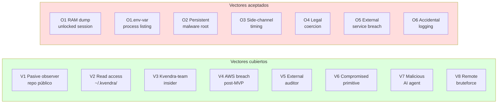

# 18. Threat model

## Descripción

El threat model formal de Kvendra CLI es **Nivel 2 zero-knowledge**, formalizado en `ADR-KVD-010` y publicado en el root del repo como `THREAT-MODEL.md`. Este capítulo es la versión narrada del documento canónico — útil para entender el modelo sin leer el ADR completo. Para referencia oficial, consulte `THREAT-MODEL.md`.

La promesa de marca, citada literal:

> *Even with full access to your filesystem (excluding the running process memory while unlocked), the only thing visible is encrypted blobs that are mathematically useless without your master password.*

Esa frase es la promesa Nivel 2. El resto del capítulo desglosa qué vectores cubre, qué vectores acepta explícitamente y por qué.

## Vectores cubiertos por Nivel 2



| # | Atacante | Capacidades | Plaintext expuesto | Mitigación canónica |
|---|----------|-------------|-------------------|---------------------|
| **V1** | Pasive observer del repo público (Apache-2.0) | Lee todo el código fuente | Ninguno | Auditabilidad como feature |
| **V2** | Lectura de `~/.kvendra/` (backup leak, snapshot disco) | Lee blobs cifrados + audit.db | Ninguno sin master password | Argon2id high-cost + AES-256-GCM client-side |
| **V3** | Kvendra-team malicioso (insider) | Acceso total a infra Kvendra | Ninguno — la key del vault nunca cruza red | Cifrado client-side antes de upload (`0.1.0` no tiene cloud aún) |
| **V4** | AWS breach (post-MVP cloud sync) | Acceso completo a S3 + Lambda + KMS Kvendra-internal | Solo blobs cifrados; KMS Kvendra-internal NO toca secrets de user | Cifrado client-side; KMS solo para infra Kvendra |
| **V5** | Auditor externo | Acceso a código + (post-MVP) infra cloud | Verificable: ningún codepath imprime/persiste plaintext | Auditabilidad |
| **V6** | Compromised primitive (bug en allowlist parser) | Ejecuta acción fuera de scope | Token usado contra endpoint no permitido | Sandbox + review proceso primitives + audit log HMAC inmutable |
| **V7** | Agente AI malicioso/comprometido | Invoca primitives arbitrarias por MCP | Solo resultado de operaciones permitidas | Allowlist DSL restrictivo + escape hatch segregado |
| **V8** | Bruteforce remoto del master password vía blob exfiltrated | Computa Argon2id en su hardware | Compute-bound (~1s/intento) | Argon2id m=64MiB cost ~1s/intento |

## Vectores L1 enumerados (Sesión 3 threat modeling)

Cuatro GAPs L1 enumerados en la Sesión 3 post `ROAD-007` cierre. **Todos cerrados estructuralmente en alpha.7 / 0.1.0**:

| # | Vector | Status | Mitigación canónica |
|---|--------|--------|---------------------|
| **GAP_1** | mcp-password fetch superficie expuesta | **CLOSED** alpha.4 | Inline keychain ACL `userPresence` en `mcp serve --use-keychain`; wrapper + fetch removidos (`REQ-KVD-005`) |
| **GAP_2** | mcp-password wrapper script en filesystem | **CLOSED** alpha.4 | Wrapper eliminado; subprocess invocado directamente vía `command + args` en `~/.claude.json` |
| **GAP_3** | TTY hijack en MCP-via-Desktop con mode `ask-destructive` | **CLOSED** alpha.5 | Transport-based approval separation (CLI=TTY, MCP=biometric reusando keychain ACL) (`REQ-KVD-006`) |
| **GAP_4** | allowlist YAML modificable por atacante L1 + cache TOCTOU | **CLOSED** alpha.6 | HMAC `kvendra/allowlist-hmac/v1` + composite cache key con HMAC del YAML (`REQ-KVD-007`) |
| **GAP_5** | `KVENDRA_HOME` env var redirect a copia del vault | **CLOSED** alpha.7 | `home_canonical` signed dentro del config.toml HMAC'd + canonicalize riguroso ambos lados (`REQ-KVD-008`) |
| **GAP_6** | mcp-password wrapper integridad sin firmar | **CLOSED** alpha.4 | Wrapper eliminado (no aplica) |
| **GAP_7** | config.toml sin firma — atacante baja `approval.mode` a silent | **CLOSED** alpha.7 | HMAC sidecar `~/.kvendra/config.toml.hmac` con sub-key `kvendra/config-hmac/v1` |
| **TTY-HIJACK** | TTY del owner secuestrada al primer `tools/call` destructive | **CLOSED** alpha.5 | Transport separation (Transport::Mcp nunca toca TTY) |

**Status global L1**: structurally complete. `0.1.0` ships con todos los vectores enumerados mitigados. Los DIFERIDOS (GAP 2 mcp transport auth, supply chain, mcp elicit) siguen out of L1 scope (no son L1 strictly — son L2/L3 / supply chain / protocol).

## Vectores explícitamente aceptados (out of Nivel 2)

| # | Vector | Por qué aceptado | Mitigación post-MVP |
|---|--------|------------------|---------------------|
| **O1** | RAM dump durante sesión unlocked | Mientras el vault está unlocked, la derived key vive en RAM. Atacante con root + ptrace puede dumpearla. Trade-off de la categoría de producto. | Hardware-backed wrapping (Secure Enclave / TPM 2.0 / Yubikey FIDO2) |
| **O1.env-var** | `KVENDRA_PASSWORD` env var visibility | El password plaintext es visible en `/proc/<pid>/environ` y `ps eww` durante la duración del comando que lo consume. Trade-off de UX vs threat model aceptado por owner para enable CI/scripts. Users en máquinas multi-tenant deben preferir `--password-stdin`. | El binary lee la env var **una vez** al inicio y `unsetenv()` antes de cualquier exec subsidiario. |
| **O2** | Malware persistente en máquina del user con privilegios root | Si el atacante puede sustituir el binario, puede lograr cualquier cosa | Reproducible builds + SLSA-signed releases (post-MVP) |
| **O3** | Side-channel timing attacks en CPU compartida | Argon2id es resistente pero no perfecto | `subtle` crate para constant-time ops |
| **O4** | Coercion legal del user ("rubber-hose attack") | El user tiene la key | Recovery codes permiten reset; no es problema técnico |
| **O5** | Compromiso de un servicio externo (GitHub, npm, AWS) | Out of Kvendra's scope | Rotation manual + revocación en el servicio |
| **O6** | Logging accidental del plaintext por un primitive maltrazado | Aceptado como riesgo de implementación | Audit log automático + review primitives + `zeroize` |

## Promesa final formalizada

**Nivel 2 zero-knowledge para `0.1.0`**:

> Ningún codepath del binario `kvendra` (Apache-2.0, auditable) imprime ni persiste a disco el master password ni la derived key. La derived key vive solo en RAM del proceso `kvendra mcp serve` durante la sesión unlocked, y es zeroizada (`zeroize` crate) al `kvendra lock` o al timeout configurable. Los blobs en `~/.kvendra/secrets/*.blob` son AES-256-GCM con clave derivada Argon2id (cost ≥1 s/intento) — opacos sin master password.

**Nivel 2 ampliado a filesystem integrity** (alpha.4..alpha.7 / 0.1.0):

> Todos los artefactos de configuración persistentes están firmados HMAC con sub-keys derivadas via HKDF de la session key (ADR-KVD-022). Atacante L1 (sin master password, con perms del user) NO puede modificar `config.toml`, allowlist YAMLs ni redirigir el vault home sin que el binario lo detecte y rechace al startup.

## Sub-keys HKDF vivas en `0.1.0`

| Sub-key | Constant Rust | Info HKDF | Propósito |
|---------|---------------|-----------|-----------|
| Audit HMAC | `vault::session::HKDF_INFO_AUDIT_HMAC` | `kvendra/audit-hmac/v1` | Firma de la audit chain |
| Allowlist HMAC | `vault::session::HKDF_INFO_ALLOWLIST_HMAC` | `kvendra/allowlist-hmac/v1` | Sidecar de cada YAML allowlist |
| Config HMAC | `vault::session::HKDF_INFO_CONFIG_HMAC` | `kvendra/config-hmac/v1` | Sidecar de `config.toml` + `home_canonical` |

Patrón formalizado en `ADR-KVD-022`: domain separation via HKDF info string. El sufijo `/v1` permite rotación de versión de la sub-key sin breaking change si la binding cambia.

## Ejecutables de la promesa

Cualquier reviewer externo puede:

1. Clonar `kvendra-cli` (Apache-2.0).
2. Auditar el path crypto (Argon2id → AES-256-GCM → zeroize) en una sesión de lectura razonable (≤2h).
3. Confirmar que ningún codepath imprime/persiste plaintext del master password ni del derived key.

Esto es uno de los success metrics canónicos del `REQ-KVD-002`.

## Tests que respaldan el threat model

`AC-VAULT-1..5`, `AC-MCP-3`, `AC-AUDIT-2` son los criterios de aceptación que aterrizan los invariantes del threat model en código. La testsuite los valida E2E:

> **AC-VAULT-2** — cualquier `~/.kvendra/secrets/*.blob` inspeccionado fuera de la sesión consiste en bytes opacos.
>
> **AC-VAULT-3** — tras `kvendra lock`, no existe ningún proceso ni fichero temporal en disco con la encryption key derivada.
>
> **AC-MCP-3** — una llamada `tools/call` con `profile_id` ejecuta la acción y devuelve el resultado **sin que el plaintext del secret aparezca en ningún campo de respuesta**.
>
> **AC-AUDIT-2** — una row manipulada manualmente en `audit.db` rompe la cadena HMAC y `kvendra audit --verify` lo detecta señalando la primera row corrupta.

## Política de divulgación

`SECURITY.md` en root del repo sigue **RFC 9116** (`security.txt`). Reporting:

```
hello@kvendra.ai
```

Vulnerabilidades L1 (no-respect del threat model) son SECURITY/HIGH severity y se priorizan sobre features.

## Notas importantes

> **Nota:** El threat model **no** cubre security ops de tu workspace (rotación de tokens, revocación tras incident, audit external). Eso es responsabilidad operacional. Kvendra te da las herramientas (audit log, expiration policy, detection layer) — usarlas con disciplina sigue siendo decisión tuya.

> **Advertencia:** Si encuentras un caso donde el threat model parece roto, **no** abras issue público. Reporta a `hello@kvendra.ai` siguiendo `SECURITY.md`. La divulgación coordinada minimiza el window de explotación entre fix y publicación.
