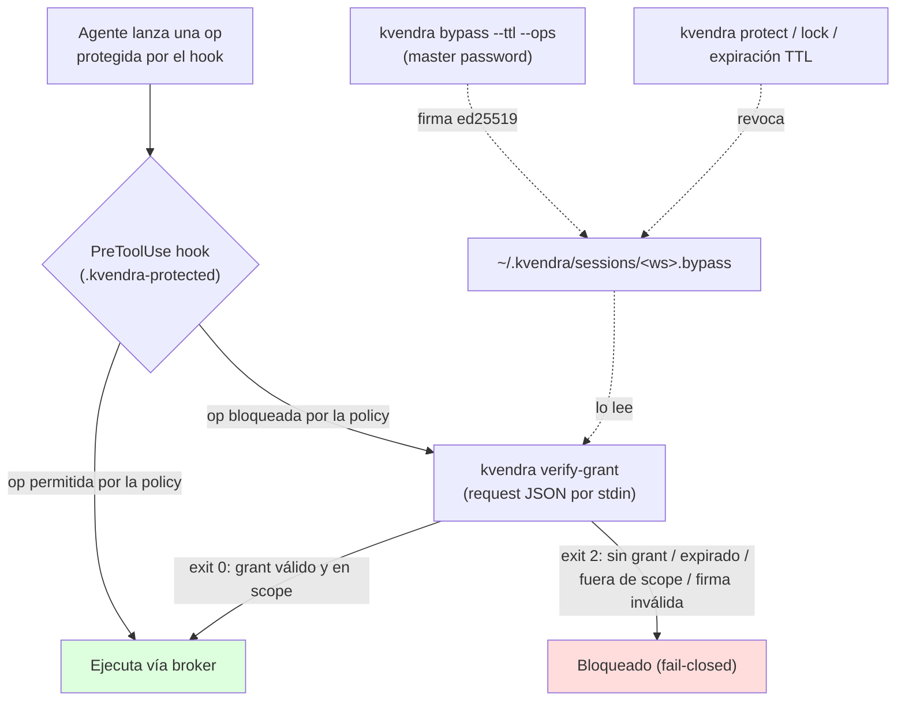

# 23. Break-glass bypass

## Descripción

El **break-glass** es la escotilla del operador para relajar, de forma temporal y auditada, el **enforcement del hook `kvendra-skills`** (el `PreToolUse` que obliga a pasar ciertas operaciones por el broker según `STD-KVD-D31D54` / la marca `.kvendra-protected`). Es la respuesta honesta a "necesito hacer esta op ahora y el hook me la bloquea": en vez de **desactivar el hook globalmente**, el operador concede una excepción **firmada, con scope acotado y con TTL**.

> **Importante:** el break-glass NO relaja el allowlist del vault ni el approval de las primitives (eso lo cubren los [cap. 7](./07-allowlist-dsl.md) y [cap. 15](./15-allowlist-enforcer.md)). Actúa una capa por encima: sobre el **hook** que decide si una op debe forzarse por el broker. Conceder un grant nunca da al agente el plaintext de un secreto.

Shipped en **v0.6.0** (`REL-KVD-CLI-0.6.0`, `REQ-KVD-SKILLS-41032D` / `ADR-KVD-SKILLS-D0CC0A`). Son **4 subcomandos del binario** (`bypass`, `protect`, `grant-pubkey`, `verify-grant`), no primitives MCP nuevas: el surface canónico no cambia (las 7 primitives canónicas + escape hatch).

## Flujo



## Los 4 subcomandos

### `kvendra bypass` — conceder un grant

```bash
kvendra bypass --ttl <DURATION> --ops <PRIM.OP[,...]> [--workspace-root <PATH>] [--password-stdin] [--rotate-key]
```

Concede un grant firmado ed25519, efímero y scope-limitado para el workspace actual.

> **`--ttl <DURATION>`** (obligatorio) — duración del grant: `15m`, `1h`, `2h`… **Capado al idle timeout del vault**: un grant no puede sobrevivir a la sesión que lo respalda.
>
> **`--ops <PRIM.OP[,...]>`** (obligatorio) — tokens `primitive.op` separados por coma, p. ej. `kvendra.git.push,kvendra.aws.s3_sync`. **Omitirlo rechaza el grant** — no hay un "off" ciego global.
>
> **`--workspace-root <PATH>`** — workspace al que aplica el grant. Por defecto, el directorio actual.
>
> **`--password-stdin`** — lee la master password de stdin (recomendado para scripts).
>
> **`--rotate-key`** — rota el par de firma antes de emitir el grant. Cualquier pubkey pinada previamente **deja de verificar**.

**Requiere la master password siempre.** (Con el vault bloqueado se pide password; con el vault desbloqueado, re-autentica igualmente — no basta con tener la sesión abierta.)

### `kvendra protect` — revocar

```bash
kvendra protect [--workspace-root <PATH>]
```

Revoca el grant del workspace **de forma inmediata e idempotente, sin credencial** (espejo de `kvendra lock`). Además, el grant se **auto-revoca** al bloquear el vault (`kvendra lock`) y al expirar el TTL.

### `kvendra grant-pubkey` — publicar la pubkey

```bash
kvendra grant-pubkey
```

Imprime la clave pública ed25519 de firma de grants (base64). **Auth-less, read-only** — no requiere unlock. La consume el hook y `sync-claudemd` para pinnearla en `.kvendra-protected`.

### `kvendra verify-grant` — verbo interno del hook

```bash
echo '{"workspace_root":"...","op":"kvendra.git.push","pubkey":"..."}' | kvendra verify-grant
```

Verbo **interno** que consume el hook `PreToolUse`. Lee un request JSON por stdin, verifica la firma **sin unlock del vault** (6 checks) y devuelve **exit 0** si el grant aplica o **exit 2 (fail-closed)** en cualquier otro caso. Contrato: `IF-KVD-SKILLS-GRANT-VERIFY` v1.0.

## Internos (`src/grant/`)

| Fichero | Rol |
|---------|-----|
| `keypair.rs` | Par ed25519. El **seed privado** se sella bajo una sub-key HKDF (`kvendra/grant-sign/v1`) derivada de la clave **maestra** del vault (AES-256-GCM). |
| `store.rs` | `~/.kvendra/sessions/<workspace>.bypass`, `0600` + `flock` + rename atómico. |
| `sign.rs` / `verify.rs` | Canonicaliza el grant con **JCS** (`serde_jcs`, RFC 8785) y firma/verifica ed25519 *detached*. |

Dependencia: `ed25519-dalek 2`. Flags de auditoría en `audit/mod.rs`: `FLAG_BYPASS_GRANTED`, `FLAG_BYPASS_REVOKED`, `FLAG_BYPASS_EXPIRED`, `FLAG_BYPASS_USED`, `FLAG_BYPASS_SIG_INVALID`.

## Por qué es seguro

> **El agente no puede forjar grants.** El seed privado se sella bajo la clave **maestra** del vault (no bajo un salt de máquina como el blob de sesión — ver el residual **C3** en el [cap. 18](./18-threat-model.md)). Sin la master password no se puede firmar un grant nuevo.
>
> **Verificable sin unlock.** El hook solo necesita la **pubkey** (pinada en `.kvendra-protected`) para verificar, así que funciona en cada `tools/call` sin re-pedir la contraseña.
>
> **Fail-closed por defecto.** Sin `--ops` no hay grant. `verify-grant` devuelve exit 2 (denegar) ante grant ausente, expirado, fuera de scope o con firma inválida. El grant muere solo al expirar el TTL, al `lock`, o con `protect`.

## Notas importantes

> **Nota:** el break-glass es para el **operador humano**, no para el agente. Conceder un grant exige la master password teclada por ti; el agente nunca puede ampliarse su propio permiso.

> **Advertencia:** un grant es una excepción real al hook mientras vive. Concede el **mínimo scope** (`--ops` con solo lo que necesitas) y el **mínimo TTL**, y ejecuta `kvendra protect` en cuanto termines en vez de esperar a que expire. La rotación (`--rotate-key`) invalida cualquier pubkey pinada antigua: úsala si sospechas que un grant se filtró.
